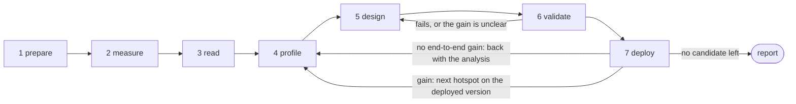

# Optimization workflow

Approach the hardware's SOL at the model's real shapes with hand-written
kernels, and cut deployed end-to-end latency.



5 and 6 are the kernel loop, one agent per kernel, in parallel; 2, 4 and 7 are
the model loop, serial. Run to step 7's exit condition: a result to report is
not a terminal state, and a human intervention is normally a stop, not a
restart. Every attempt states one falsifiable hypothesis, the observation behind
it, the time it should recover, and the cheapest experiment separating it from
the alternative; an ambiguous result revises it rather than adding a candidate.

1. **Prepare.** Project root, target GPU, the model's own Python environment,
   real checkpoint, fixed inputs and run parameters. Use an existing Target;
   onboard a new one with [target-onboarding](../target-onboarding/SKILL.md).
   LingBot resolves checkpoint and fixture through `FLASH_VLA_ASSETS`, a JSON
   map of asset ids to local paths; synthetic-weight Targets need none.

2. **Measure the current model and check its output.** `shipped` is the
   comparison point.

   ```bash
   python -m benchmarks latency --target h100/lingbot_vla --plan shipped --seed 42 --out results/lingbot-h100/run-name/measurements/000.json
   ```

   Two versions are comparable only under the conditions in
   [measurement](references/measurement.md), read before a round's first timing.

3. **Read the model.** `vision_encoder -> llm_backbone -> action_expert` against
   [ARCHITECTURE.md](../../../ARCHITECTURE.md): shapes, call counts, existing
   optimizations, repeated work inside the denoising loop.

4. **Profile top down and pick a bottleneck worth the work.** Whole-forward GPU
   timeline with [gpu-profiler-analysis](../gpu-profiler-analysis/SKILL.md) for
   the costly module or host/sync gap, then down to call sites and kernels;
   [ncu-report](../ncu-report/SKILL.md) where counters settle compute- against
   memory- against pipeline-bound. Size the headroom from the call count,
   `tools.profiling.floor` and the measured constants in
   [hardware-unit-test](../hardware-unit-test/SKILL.md).

   ```bash
   python -m tools.profiling.model --target h100/lingbot_vla --plan shipped --seed 42 --overview --trace-dir artifacts/profile/overview
   # Descend only when the overview points at action_expert: --segment action_expert
   ```

5. **Design and implement, in parallel.** One agent and worktree per kernel or
   fusion chain, iterating with [kernel-design](../kernel-design/SKILL.md),
   which owns the search and the implementation choices. A delegated prompt
   carries the target and its evidence, the shapes and layout, what may change,
   the hypothesis, how to validate it and what to return -- not a copy of this
   session. Fan-out, the one GPU lock, rebasing on a moved base and replacing
   a stalled agent follow [delegation](references/delegation.md). A
   [kernel-wiki](../kernel-wiki/SKILL.md) miss on a solved problem makes
   writing that page part of this round's output.

6. **Validate the kernel: correctness, then local gain.** Existing references
   and tolerances, then [benchmark-kernel](../benchmark-kernel/SKILL.md) under
   the real layout, cache state and execution conditions. A failure or uncertain
   gain stays in the kernel loop. **Hand a candidate over once it is correct and
   its local gain is credible** -- it need not be finished. Timing on one GPU is
   serial; nothing else runs during a model timing run.

7. **Integrate, deploy and measure, one candidate at a time.** Into the current
   best model and plan; run the correctness checks it affects, plus a task
   quality check if it approximates; deploy to the real inference path; re-run
   step 2 against the plan actually loaded, saved beside it as `001.json`. Keep
   it on an end-to-end gain, else revert or record it as uncertain. After K1 is
   accepted, K2 compares `M+K1` against `M+K1+K2`.

   **A local gain that does not reach the model returns to step 4** with the
   analysis, and 4-5-6-7 runs again; one that does picks the next hotspot from
   the deployed version. Re-validate only what the change touches, and reuse a
   profile whose bottleneck has not moved.

   **To end**, answer the six [conclusions](references/conclusions.md) checks,
   then give each leading hotspot its share of reachable capability and why no
   candidate remains; without both it is not finished. Only three things need
   approval: the numerical contract, changed measurement conditions, an
   exhausted budget.

Save each round's change, revision, command, environment, correctness result and
raw benchmark JSON under `results/<target>/<run>/`, append the trial to
`iterations.csv` with the `group` the [results
tools](../../../measurement/results/README.md#the-progress-figure) define -- the segment
whose time the change cut, `multi-stage` when it cannot be assigned to one,
`control` for a row that changes no module -- so the figure colours every
milestone by module, and redraw with `python -m measurement.results curve
results/<target>/<run>`. Step 7's two denominators go in that run's
`figure.json`, which is what draws the share-of-floor panel; without it the same
renderer produces the same figure with a panel missing ([results
tools](../../../measurement/results/README.md)). Keep the candidates that did not gain,
but let only retained versions advance the curve -- a kernel's local gain never
stands in for model latency on it. Report the
deployed version and its comparable end-to-end change, correctness evidence,
failed and uncertain conclusions, remaining bottlenecks and the next hypothesis;
an unmeasured gain is not reported, and no round adds a hash, contract or gate.
