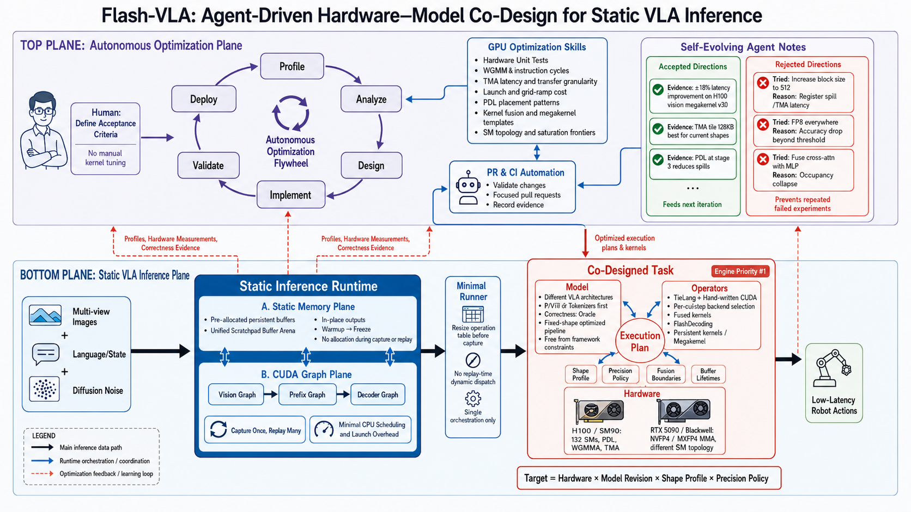

# Architecture

This repository builds fixed-workload VLA inference targets. Peak end-to-end
action latency on one fixed workload takes priority over a universal operator
abstraction, so the atomic unit of production is neither a model nor a kernel:

```text
Target = hardware x inference-compatible model revision x shape profile
Workload = Target x ExecutionVariant
```

Everything specialized — buffers, fusion boundaries, tile configurations,
kernels — belongs to one Target. A Target owns a machine-checkable inference signature. Checkpoint values, task,
source revisions and filesystem locations are provenance rather than Target axes.
Direct latency comparisons additionally require the same measurement context
and stable environment.



## The boundary

`src/flash_vla/runtime/` owns what is invariant across every Target: the op
vocabulary, the explicit computation graph and the API that builds it, the VLA
template, the one `ModelRunner`, the static arena and graph capture, plan
binding, and the identity every report carries. It knows no model, no backend
and no device.

The Target owns everything else: its model contract, its graph, its backends
and their kernels, and the plans that route call sites to them. A
specialization that helps one Target and not another lives in that Target.

## The template

Inference is three stages, in this order:

```text
images -> vision_encoder -> [host slot] -> llm_backbone -> action_expert -> actions
```

`vision_encoder` embeds the camera views, `llm_backbone` builds the prefix KV
cache, `action_expert` denoises the action chunk over that cache. A host slot
is optional host work between two stages, ordered by the program and hidden
behind the preceding stage's replay.

Onboarding a model means rewriting its original forward pass as an explicit
graph over the op vocabulary: every op names its inputs, outputs and weights,
and Python loops only construct nodes. This is the relation vLLM's model files
have to their transformers originals — the rewrite need not be written the way
the original was, and its correctness is judged only by the precision gate
against the original implementation.

## Dependency direction

```text
runtime/                              -> nothing model-, backend- or Target-specific
models/<model>/                       -> nothing hardware-specific
hardware/<vendor>/<device>/<model>/   -> models/ + runtime/ + its own backends/
                                         + the device's component packages
hardware/<vendor>/<device>/<component>/ -> models/ + runtime/ + hardware/<vendor>/cuda/tile/
                                         + hardware/<vendor>/tilelang/
hardware/<vendor>/tilelang/           -> nothing of this repository's
eval/, benchmarks/                    -> ModelRunner + the Target registry
                                         (benchmarks/targets.py)

src/ never imports eval/, benchmarks/ or lab/.
No Target imports another Target's kernels.
A component package imports no Target.
The deployment path never imports lab/.
```

A component package (`hardware/<vendor>/<device>/<component>/`, one per model
component the device's Targets share: `siglip`, `gemma_backbone`,
`gemma_expert`) holds the kernels and the backend factories of that component
on that device, written once. Two vendor-level libraries sit below both
packages and Targets and are specific to neither a model nor a device:
`hardware/<vendor>/cuda/tile/` for the CUDA tile primitives and
`hardware/<vendor>/tilelang/` for the TileLang JIT conventions. A Target registers the package's backends under
names of its own and keeps every routing decision; two Targets sharing a
component share its kernels and diverge only in their plans.

## The runtime interface

| module | owns |
|---|---|
| `runtime/ops.py` | `OpSpec`: one call site's parameter order, outputs, weights, FLOP formula |
| `runtime/graph.py` | `Graph`, `BufRef`, `WeightRef`: the forward pass as data, and the builder API |
| `runtime/vla.py` | `VLA`, `Input`, `STAGE_OUTPUTS`: the template a Target subclasses |
| `runtime/runner.py` | `ModelRunner`: materialization, execution, capture, attribution, costs |
| `runtime/registry.py` | `Registry`: how a Target's backends are named, routed and built |
| `runtime/binding.py` | route constraints and their validation against a plan |
| `runtime/engine.py` | the `Engine` protocol every harness is written against |
| `runtime/cuda/` | `StaticArena` (fixed addresses), `Program` (warmup, freeze, capture, replay) |
| `runtime/identity.py` | `Identity`: Target axes, plan, engine revision, and report-schema compatibility |
| `runtime/cost.py` | `Cost`, `Invocation`, `Ceiling`, `SegmentCosts`: the minimal traffic and math a floor divides, and a call site's declared measured ceiling |

## Invariants

- Each CUDA graph owns one dedicated stream for both capture and every replay.
  Caller-stream input and output dependencies are preserved. Each measured version
  runs in a fresh process and measures only its initial capture; model loading
  and capture remain outside timed inference.
- A plan is resolved and validated against every route constraint before
  capture, never at the first replay.
- Nothing allocates after the workspace allocator freezes; a request warmup did
  not cover raises instead of allocating inside a capture.
- Every op writes its outputs in place through the parameters its spec names;
  return values are ignored.
- Buffers, their padding and their alias views are declared data, not a
  consequence of running the graph.
- New runner reports carry Identity v3. A workload match requires hardware,
  model, architecture revision, inference signature, complete shape and
  ExecutionVariant. Plan and engine revision are candidate provenance.
  Targets own architecture metadata; producers pass checkpoint provenance
  separately. The runner checks weight ABI before allocation. Dirty source
  has no resolved engine revision.
- MeasurementContext separates weights, fixture and comparable environment
  from Target identity. Compared versions must share workload/environment conditions. Checkpoint,
  fixture or environment changes cannot be attributed as candidate speedup.
  Reference implementation revisions remain oracle provenance.
- Legacy Identity v1/v2 remains readable with its original schema. Explicit
  v2 migration retains old checkpoint provenance and requires correctness
  revalidation and a new latency anchor. Unknown Targets require an explicit
  architecture mapping.
- The floor model guides kernel work toward hardware SOL; it does not establish
  attainable latency or convergence by itself. Its ceiling divides only by
  tagged measured constants of the hardware axis's `measured/` table, its
  roofline only by the axis's `spec.py` peaks. Remaining headroom informs the
  next hypothesis; measured end-to-end latency determines the value of a change.

## What a Target is

One `target.py` holding the model contract (configuration, ordered shape axes
and shape numbers,
weight schema and loader), the shipped plan, the reference plan and the backend
registry; one `pipeline.py` whose `build` writes the graph; its `backends/`;
a factory entry in `benchmarks/targets.py`; and an acceptance entry in
`eval/acceptance.py`. There is no engine, buffer plan or cost table to write.
A backend in the registry is any object satisfying the registry contract
(`runtime/registry.py`): the Target's own `backends/` module, or the
`make_wrappers(scratch, selected_names)` factory of a device component
package. Either way the Target owns the routing, the plans and the route
constraints; the package owns the kernels.

## Deployment configuration

Targets name logical assets. Machine configuration maps those identifiers to local
paths; paths never enter shape, inference signature or Target identity.
For file-backed LingBot construction, set FLASH_VLA_ASSETS to a JSON mapping
of logical IDs to paths, or pass asset_config to its factory. Relative asset
paths resolve beside that JSON file. Explicit checkpoint/fixture paths still
require their separate immutable identities. The runner copies resolved assets
read-only for its sampler and backend initialization, so another runner cannot
change its assets through process environment variables.

Official acceptance runtimes are configured before process startup with
OPENPI_PYTHON (Pi0/Pi0.5) or LINGBOT_PYTHON. Pi0's official checkpoint additionally
uses OPENPI_PI0_CHECKPOINT and an explicit immutable ID through
OPENPI_PI0_MODEL_REVISION (legacy variable name) or its CLI options. These values
have no machine-specific repository defaults; missing configuration makes the
official tier unavailable.

Each Target carries exactly one shipped plan and one reference plan (its
correctness oracle route). Everything else — candidate plans, ablations,
per-kernel trials — lives in `lab/`, the optimization workspace, which is
tracked in git, may import the deployment path, and is never imported by it.

## The optimization loop

[docs/optimization.md](docs/optimization.md) owns the default agent workflow:

```text
Kernel: Profile -> Analyze -> Design -> Implement -> Validate -> Profile
Model:  Profile -> Analyze -> Design -> Implement -> Validate -> Deploy -> Profile
```

Start with the complete forward, then focus on its costly modules and kernels.
Compare their work and measured time with the datasheet roofline and applicable
measured hardware capabilities to identify recoverable time. Reuse existing
Pi0/Pi0.5 and shared-component kernels, then improve kernel layout, tiling,
memory traffic, fusion and pipelines toward the hardware's attainable SOL.
Fusion candidates use explicitly written CUDA/TileLang kernels; existing
`torch.compile` paths can serve as comparison implementations.

The model loop selects the hotspot and invokes the kernel loop. Kernel Validate
checks numerical correctness and local performance for the kernel or fused chain
under representative shapes, layouts, cache and execution conditions. Only a
correct candidate with demonstrated local gain proceeds to model integration;
failed or uncertain candidates stay in the inner loop. A winning kernel can
advance without exhausting every possible kernel improvement.

Model Design/Implement integrates that candidate into the model and plan.
Model Validate checks the affected model outputs and integration behavior.
Deploy runs the validated model through its actual inference path on the target
GPU. Then measure the deployed complete model using its actual entry point,
assets, inputs and execution settings in independent
first-capture processes, including host work and synchronization. This deployed
end-to-end measurement determines whether to retain or roll back the candidate.
The outer loop profiles the deployed version to select the next kernel task,
and feeds integration findings back to the inner loop when local gains do not
reach the model. A local win or a floor ratio alone does not finish optimization.
Reuse applicable evidence, refresh profiles when needed, and retain only a short
experiment record.
These tools run directly; Campaign state, complete qualification and publication
are optional and do not govern routine iteration. Repository commands and paths
are relative to the project root; machine-specific assets belong in local config.

| skill | owns |
|---|---|
| `target-onboarding` | unfamiliar-model integration from frozen upstream/oracle through compatibility, correctness, baselines, floor/profile, and Campaign handoff |
| `kernel-design` | the kernel loop: hypothesis, design, reference, parity and local performance; winning candidates feed the model loop |
| `kernel-wiki` | the queryable sm90 knowledge base built on KernelWiki: symptom-indexed patterns, techniques, hardware and kernel pages with sources, confidence and reproducibility, and the compile-checked sm90 templates bundle |
| `benchmark-kernel` | per-kernel timing and the amortized in-graph regime |
| `hardware-unit-test` | the measured constants under every ceiling, and their probes |
| `gpu-profiler-analysis` | Torch, Nsight Systems and Nsight Compute capture |
| `ncu-report` | reading a Nsight Compute report into a named bottleneck |

The `target-onboarding` skill sequences the "What a Target is" implementation
without moving model semantics into runtime. Skills carry portable experience
only; evidence (job ids, measurements, rejected candidates) lives in Agent
Notes, where a rejection ranks with an acceptance: it stops the next agent from
repeating an expensive, invalid experiment.

## Evaluation

`python -m benchmarks {latency,profile,kernels,floor}` take the Target as an
input, as do `python -m eval.correctness` and `python -m eval.gate`, which
turns the registry's checks and an A/B/A into one verdict. `python -m
eval.smoke` checks every Target's declarations on a login node, without a
device. `eval/acceptance.py` is the one registry of what the human defines:
accuracy requirements, framework conventions and each Target's budget. The
official-baseline tier is per model: `eval/pi05/reference.py`,
`eval/pi0/reference.py`.

Decisions, their alternatives and their evidence live in
[Agent Notes](.agents/notes/README.md).
