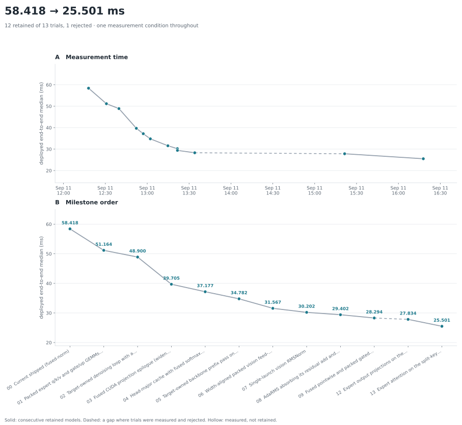

# LingBot-VLA-4B · H100 · run-01

Deployed end-to-end latency of `h100/lingbot_vla` on its real post-training
checkpoint and frozen seed-42 fixture, starting from the current `shipped`
plan. The objective is the deployed `chunk_latency` median.



## Workload and measurement conditions

| | |
|---|---|
| Target | `hardware/nvidia/h100/lingbot_vla`, bf16, 36 layers, 10 denoise steps |
| Checkpoint | `lingbot-vla-4b-posttrain-robotwin@fb71a2c…+qwen2.5-vl-3b@66285546…` |
| Fixture | `lingbot-robotwin-canonical-v1/seed-42` (prompt "adjust bottle") |
| Shape | 3 views × 224², 192 visual + 72 language = 264 prefix tokens, 51 suffix tokens |
| Environment | Python 3.12.12, torch 2.9.1+cu126, H100 80GB HBM3, `acd_u` |
| Protocol | `latency-v2`: fresh process and first capture per leg, warmup 5, 100 reps, no soak, median |

Commands run from the project root with `FLASH_VLA_ASSETS` pointing at the
machine-local asset map and `LINGBOT_PYTHON` selecting the upstream environment:

```bash
python -m benchmarks latency --target h100/lingbot_vla --plan shipped --seed 42 \
  --warmup 5 --reps 100 --out results/lingbot-h100/run-01/measurements/000.json
python -m eval.lingbot.parity --plan shipped --seed 42 --layers 36 --steps 10 \
  --out results/lingbot-h100/run-01/correctness/000-shipped-parity.json
```

Each model trial is measured against the retained version in the **same job on
the same physical GPU**, because the partition mixes two driver generations
(570.86.10 and 610.43.02) and a leg's measurement context records the driver.
The two differ by 6-8% on this workload, so absolute medians are only
comparable within a job.

Jobs run from a snapshot of `src/`, `lab/`, `benchmarks/`, `eval/` and `tools/`
taken at job start, because the editing session continues while a latency leg
re-imports the package in a fresh worker minutes into the job.

## Result

**58.475 ms -> 28.327 ms deployed median, 2.064x**, every point measured in one
job on one GPU (614462, ACD1-55, driver 610.43.02) so the curve is a single
measurement condition:

```bash
python -m benchmarks latency --target h100/lingbot_vla --seed 42 --warmup 5 --reps 100 \
  --plan lab/plans/lingbot-fused-norm.json ... --plan shipped \
  --out results/lingbot-h100/run-01/measurements/ladder.json
```

`latency_ms` in `iterations.csv` is that ladder's median for each route; the
`report` column points at each trial's own paired A/B, which is what decided
it. Iterations 10 and 11 changed no route (10 was reverted, 11 is not
plan-selectable after its measurement) and carry no ladder leg, so their
`latency_ms` is blank and their measured deltas are in the table below.

## Iteration 0 — start point

`shipped` = `fused-norm` on all three call sites (`ef798e0`).

Three legs of the start version, one job (614199, ACD1-6, driver 570.86.10):

| leg | min | median | p99 |
|---|---:|---:|---:|
| 0 | 61.208 | **61.253** | 61.474 |
| 1 | 61.605 | 62.415 | 62.630 |
| 2 | 61.209 | 61.254 | 61.530 |

Repeat-leg spread: 0.397 ms on `min`, **1.162 ms on `median`**. A single
unpaired median difference below ~1.2 ms is therefore not distinguishable from
run-to-run drift; paired same-job A/B is used for every decision. (That job ran
on the 570 driver; the consolidation ladder puts the same version at 58.475 ms
on the 610 driver.)

Correctness (614205, ACD1-21, driver 610.43.02): full-depth 10-step parity
against the frozen upstream eager oracle **passes**; `vision_embeddings`,
`prefix_k` and `prefix_v` are bit-identical, and the denoised outputs are within
the bf16 `deepest` tolerance (`actions` cos 0.9999986, `physical_actions`
cos 0.9999752). Replay is deterministic.

Overview profile (same job): GPU activity 57.26 ms inside a 64.30 ms span, so
7.04 ms sits in host/launch gaps under the profiler.

## Where the time was

`python -m tools.profiling.model --target h100/lingbot_vla --plan shipped --seed 42`
on the start version (job 614222, torch-profiler replay, diagnostic only —
profiled totals run ~15% above the uninstrumented benchmark):

| segment | in-graph | launches | under one wave |
|---|---:|---:|---:|
| `vision_encoder` | 10.40 ms | 1272 | 498 |
| `llm_backbone` | 10.46 ms | 2188 | 559 |
| `action_expert` | **50.47 ms** | **17104** | 10944 |

The expert issues 47 kernels per layer-step across 36 layers and 10 denoise
steps, and 14.62 ms of its 50.47 ms is copy kernels. Against the machine's
measured `launch.lat.dev.ramp` of 1.24 µs per launch, the launch count alone
accounts for most of the segment, so every accepted change below removes
launches at unchanged arithmetic rather than making a kernel faster.

The vision encoder's three feed-forward projections ran
`cutlass_80_tensorop_bf16_s16816gemm_bf16_256x128_64x3_tn_align2` at 57.4 µs
each (5.51 ms of 10.40 ms) because its 3420-wide FFN is not 8-element aligned.

## Trials

Each row is a paired A/B/A in one job on one GPU: the retained plan, the
candidate, then the retained plan again. `delta` is the candidate's median
against leg 0; `spread` is leg 2 against leg 0, the drift this comparison could
not have resolved.

| # | change | base | candidate | delta | spread | decision | job |
|---|---|---:|---:|---:|---:|---|---|
| 1 | packed q/k/v and gate/up GEMMs, grouped attention | 62.162 | 55.494 | **−6.668** | 0.069 | keep | 614224 |
| 2 | Target-owned denoising loop, resident KV cache | 51.204 | 48.969 | **−2.235** | 0.008 | keep | 614238 |
| 3 | fused CUDA projection epilogue (widen + RoPE + cache write) | 52.578 | 42.267 | **−10.313** | 0.002 | keep | 614268 |
| 4 | head-major cache, fused softmax and attention epilogue | 39.754 | 37.300 | **−2.454** | 0.018 | keep | 614286 |
| 5 | Target-owned backbone prefix pass on the same kernels | 37.308 | 34.983 | **−2.324** | 0.008 | keep | 614301 |
| 6 | width-aligned packed vision feed-forward | 34.975 | 31.739 | **−3.236** | 0.017 | keep | 614331 |
| 7 | single-launch vision RMSNorm | 33.663 | 32.339 | **−1.324** | 0.012 | keep | 614349 |
| 8 | 7 plus AdaRMS absorbing its residual and a fused gated activation | 31.815 | 29.799 | **−2.016** | 0.002 | keep | 614350 |
| 9 | fused pointwise and packed gate/up in the backbone | 31.000 | 29.806 | **−1.194** | 0.001 | keep | 614377 |
| 10 | fused flash-form attention kernel | 28.419 | 201.797 | **+173.378** | 0.002 | revert | 614399 |
| 11 | single-pass masked softmax | 29.756 | 29.752 | −0.004 | 0.007 | uncertain | 614448 |

Iterations 7 and 8 were run in parallel against the same retained plan on two
GPUs, so 8 is the superset and the one deployed; 7's number attributes the
split between the vision and expert halves. Iterations 1, 2 and 7 landed on
driver 570.86.10 and the rest on 610.43.02, which differ by ~6-8% on this
workload — the reason every decision is a paired same-job comparison and the
curve comes from one final ladder job rather than from these legs.

### Why iteration 10 failed

The flash-form attention kernel is numerically fine (within one bf16 ulp of the
torch chain at the real shape) but seven times slower than the model it
replaces. With one warp per (head, query row) each of the 816 warps streams the
whole 645 KB key/value cache, so a layer-step moves about half a gigabyte
through L2 against the 1.5 MB the operation actually touches. Sharing the cache
across a query tile is what flash attention does with a shared-memory tile, but
here the query tile is only 51 rows and 16 heads: covering the machine's 132
SMs and reusing the cache at the same time needs a split over the key axis and
a second reduction pass. The kernel is kept in `cuda/kernels/attention.cu` as
the evidence for that, unrouted.

### Correctness

Full-depth ten-step parity against the frozen upstream eager oracle
(`eval.lingbot.parity`) passes at every trial, with `replay_identical` and no
numerical failures. Iterations 1-5 keep the vision and prefix outputs
bit-identical to the oracle; from iteration 6 the vision feed-forward runs on a
different cuBLAS kernel, whose bf16 accumulation order moves the vision
embeddings to cos 0.99996 (rel_rms 8.9e-3) and the final `physical_actions` to
cos 0.99995, against thresholds of cos 0.9943 and rel_rms 0.34.

That iteration is worth reading carefully: the padding adds only zero weights
and zero biases, and `python -m lab.lingbot_vision_mlp_check` measures one layer
at the real shape at rel_rms 3.0e-3 against the unpadded expression — an
accumulation-order difference, not a different value. Iteration 6 alone briefly
put `physical_actions` at cos 0.99870 and iteration 7 returned it to 0.99996
while barely changing the vision drift, which says the deep-output cosine is a
chaotic function of tiny upstream perturbations rather than a monotone quality
measure. The stable statements are that the vision and prefix drift stays at
bf16-accumulation level and that every trial clears the tolerance with margin.

The hand-written kernels are checked against their torch expressions at the
Target's real shapes by `python -m lab.lingbot_kernel_check` (job 614461). The
projection epilogue, the attention epilogue, the RMSNorm, the AdaRMS-with-
residual and the gated activation are **bit-identical**; the masked softmax
differs by 2.8e-9 and the unrouted fused attention by 9.8e-4, one bf16 ulp.

## What is left

Uninstrumented breakdown of the deployed route (job 614494,
`benchmarks latency --breakdown`, medians):

| | ms | share |
|---|---:|---:|
| `vision_encoder` | 4.051 | 14% |
| `llm_backbone` | 5.238 | 18% |
| `action_expert` | **18.600** | **65%** |
| input staging, host work, graph launches | 0.514 | 2% |
| chunk latency | 28.403 | |

Host and launch overhead is 0.5 ms, so there is nothing to recover outside the
segments. A second profiler replay on the same route (job 614367, diagnostic
only, and about 15% above the uninstrumented numbers above) says where the
segment time goes after iteration 8:

| segment | in-graph | launches | was |
|---|---:|---:|---:|
| `vision_encoder` | 4.38 ms | 753 | 10.40 ms / 1272 |
| `llm_backbone` | 6.70 ms | 1080 | 10.46 ms / 2188 |
| `action_expert` | 20.43 ms | 4534 | 50.47 ms / 17104 |

The expert is down to 12.6 launches per layer-step from 47, and its copy time
from 14.62 ms to 0.10 ms. What remains there, per launch and against the
machine's measured `1.85 + MB/2.77` cold-read model:

| stage | per layer-step | total | floor | note |
|---|---:|---:|---:|---|
| `o_proj` + `down_proj` | 2 x 6.29 µs | 4.53 ms | ~3.0 / 3.4 µs | 96 CTAs |
| `gate_up` GEMM | 5.92 µs | 2.13 ms | ~4.9 µs | 88 CTAs |
| `qkv` GEMM | 5.06 µs | 1.82 ms | ~3.3 µs | 80 CTAs |
| QK matmul | 7.08 µs | 2.55 ms | ~2.3 µs | float32 SIMT, not TF32 |
| PV matmul | 6.85 µs | 2.47 ms | ~2.3 µs | |
| `ada_rms_add` x2 | 2 x 3.52 µs | 2.53 ms | ~2.0 µs | 51 CTAs, one per row |
| softmax | 4.56 µs | 1.64 ms | ~2.6 µs | |
| RoPE, gated activation, epilogue | 5.9 µs | 2.13 ms | at floor | |

Three things set the remaining floor:

1. **The four projections are 8.48 ms and all run under 132 CTAs**, which is
   exactly the regime `ld.ctas.dev.knee` prices at 1.63x, and cuBLAS sits
   1.2-2.0x above the streaming floor on them. A hand-written weight-stationary
   kernel was built for them (one warpgroup per CTA over a `tile_n` slice, M=51
   padded to wgmma's 64, a TMA ring feeding `wgmma.m64xNx16` from shared memory,
   with tile width, ring depth, split-K and cluster multicast all swept) and
   benchmarked cold at the real M=51 against cuBLAS:

   | shape | weight MB | floor | cuBLAS | mainloop only | full kernel |
   |---|---:|---:|---:|---:|---:|
   | packed qkv | 3.93 | 3.27 | 4.78 | **3.75** | 5.12 (0.93x) |
   | packed gate_up | 8.45 | 4.90 | 5.85 | **5.18** | 5.91 (0.99x) |
   | `o_proj` | 3.15 | 2.99 | 5.72 | **3.53** | 6.23 (0.92x) |
   | `down_proj` | 4.23 | 3.38 | 6.64 | **3.91** | 6.72 (0.99x) |

   **The shipped kernel loses on all four, and the streaming hypothesis behind
   it is nevertheless confirmed.** "Mainloop only" is a real build
   (`SKINNY_PROBE_NO_EPILOGUE`: the same TMA loads and the same wgmma, epilogue
   replaced by a guarded store), and it runs 1.12-1.68x cuBLAS at 1.06-1.18x
   the `1.85 + MB/2.77` floor. Spreading these over 120-240 CTAs does reach the
   floor; what costs more than it buys is getting there, and the two costs were
   measured separately:

   - `o_proj` and `down_proj` are N=768, only 12 tiles of 64, so they need
     split-K, and the cross-SM reduction costs 1.8-2.5 µs. Accumulating with
     `red.global.add` was worse at ~8 µs, which is L2's ~100 G atomics/s rather
     than a tuning miss; per-split partials, a distributed reduction and
     staging the partial through the dead ring brought it to 1.8-2.5, of which
     ~1.3 µs is publishing 13 KB per CTA behind a device-scope release fence.
   - qkv and gate_up need no split-K, so their wall is that every CTA re-reads
     the whole activation from L2: at the tile width that supplies enough CTAs,
     qkv moves 6.2 MB of activation against 3.9 MB of weight, against a
     measured ~2.1 TB/s aggregate load ceiling. Cluster-of-two TMA multicast is
     implemented and correct but slower (7.44 and 7.94 µs, job 614485) because
     rank 0 waits on a cross-CTA empty barrier in the same thread that issues
     its own weight box, putting a cluster round trip on every stage.

   Numerically the kernel is bit-identical to cuBLAS on the two split=1 shapes
   and differs only by K-reduction order on the other two (rel_rms 7.4e-5 and
   1.3e-4); against fp32 all four match cuBLAS's own error. So this is
   **"not beaten in the time spent", not "cannot be beaten"**: the mainloop has
   ~2.7 µs in hand against a ~2 µs epilogue. The two unexplored fixes are a
   dedicated producer warp owning the multicast, so the cluster wait leaves the
   consumer's critical path, and moving the split-K reduction into distributed
   shared memory to drop the global round trip and the device fence. Work and
   jobs are in the `skinny-gemm` branch and worktree.
2. **The attention is 6.66 ms** and wants the split-key flash kernel that
   iteration 10 did not implement. The QK matmul additionally fell off the TF32
   path onto a float32 SIMT kernel when the cache went head-major, which is
   worth one experiment on its own (store the keys transposed so the product is
   `nn`).
3. **`ada_rms_add` cannot fill the machine**: a row-wise reduction over 51 rows
   is 51 CTAs whatever the block size, and two of them per layer-step is 1.33 ms
   of pure grid ramp. Folding them into the preceding GEMM's epilogue is the
   only way past that.

Below the expert, the vision encoder's three feed-forward GEMMs are now within
~1.25x of their compute roofline and the backbone's within ~1.5x of their
streaming floor, so both towers are closer to done than the expert is.

Two cheaper things were also checked and are not worth pursuing: the QK matmul
fell off the TF32 path onto a float32 SIMT kernel when the cache went
head-major, but the PV matmul next to it is TF32 and costs the same 6.9 µs, so
the kernel choice is not what sets that time; and host, staging and graph-launch
overhead is 0.514 ms of 28.4 ms, so there is nothing outside the segments.

## Final state

`shipped` = `fused-backbone` on all three call sites. Verified on the exact
committed source (job 614503, ACD1-30, driver 610.43.02):

- every hand-written kernel matches its torch expression (bit-identical except
  the masked softmax at 2.8e-9 and the unrouted fused attention at 9.8e-4);
- full-depth ten-step parity against the upstream eager oracle passes, replay
  deterministic, `physical_actions` cos 0.9999537 against a 0.9943 threshold;
- three legs of the deployed version: 28.370 / 28.382 / 28.372 ms median, a
  repeat-leg spread of 0.012 ms.
