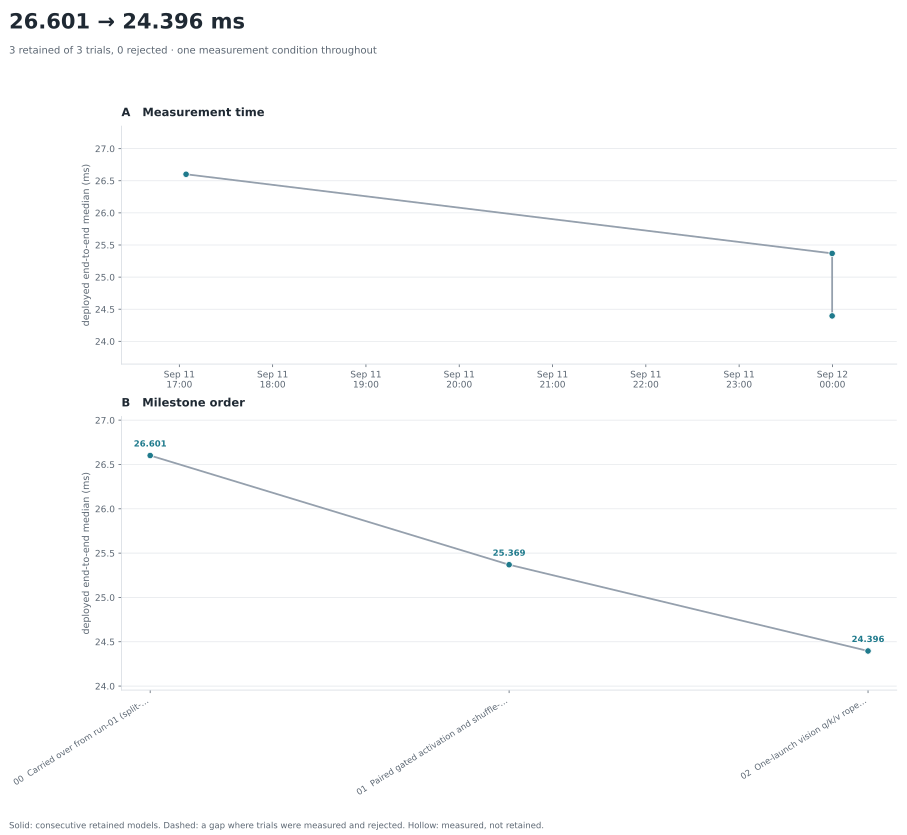

# LingBot-VLA-4B · H100 · run-02

Continues [run-01](../run-01/README.md) from its final version, with an
explicit target: reach Pi0.5's 15.864 ms, which a pure roofline comparison says
LingBot should be capable of.

Workload, checkpoint, fixture, environment and protocol are run-01's; only the
starting version differs. Every number here is driver **570.86.10**, which runs
this workload ~4% slower than the 610 the run-01 curve used — run-01's final
version measures 25.501 ms on 610 and 26.601 ms on 570, and this run uses the
570 figure as its start so the two points either side of each change share a
driver.

## Result so far

| # | change | median | delta |
|---|---|---:|---:|
| 0 | run-01 final (`split-attention`) | 26.601 | |
| 1 | paired gated activation, shuffle-reduced norms | 25.369 | **−1.232** |
| 2 | one-launch vision q/k/v rope | 24.396 | **−0.973** |

Iteration 2 is paired in one job (615599). Iteration 1 is not plan-selectable —
it changes kernels the deployed route already uses — so it is measured as the
same route before and after on the same driver, and attributed per kernel by
profile:

| kernel | segment | before | after |
|---|---|---:|---:|
| gated activation | backbone | 14.30 µs | 8.35 |
| gated activation | vision | 11.37 | 7.35 |
| gated activation | expert | 2.12 | 1.81 |
| `ada_rms_add` | expert | 3.51 | 2.66 |
| `rms_norm_add` | backbone | 7.19 | 3.21 |
| `rms_norm` | vision | 4.73 | 3.52 |
| masked softmax | backbone | 8.82 | 8.41 |

In-graph total across the run: 26.847 → 23.579 ms (jobs 615421, 615538, 615555,
615567).

## Where the remaining time is

Profiled in-graph after iteration 2 (job 615567; profiled totals run a few
percent above the uninstrumented benchmark):

| segment | in-graph | launches |
|---|---:|---:|
| `vision_encoder` | 3.068 ms | 369 |
| `llm_backbone` | 4.784 ms | 443 |
| `action_expert` | **15.727 ms** | 3814 |

The expert, per layer-step (360 of them):

| stage | each | total | streaming floor |
|---|---:|---:|---:|
| `o_proj` + `down_proj` (skinny GEMM) | 2 × 5.69 µs | 4.10 ms | 2.99 / 3.38 µs |
| split-key attention (slices + combine) | 9.34 + 3.24 | 4.53 ms | 2.40 |
| `gate_up` (cuBLAS) | 5.86 | 2.11 ms | 4.90 |
| `qkv` (cuBLAS) | 5.01 | 1.80 ms | 3.27 |
| `ada_rms_add` ×2 | 2 × 2.66 | 1.92 ms | ~2.0 |
| RoPE + gated activation | 2.02 + 1.81 | 1.38 ms | at floor |

## The 15.864 ms target is not reachable at this structure

The target came from a pure roofline comparison, which puts LingBot at 4.07 ms
against Pi0.5's 4.83 and therefore says LingBot should be the *faster* of the
two. That comparison divides by datasheet peaks — 3.35 TB/s and 989 TFLOPS —
and so assumes every launch fills 132 SMs. LingBot's expert runs 51 rows; its
operators occupy 51 to 128 CTAs. Priced instead against the machine's measured
cold-read model, `t_us = 1.85 + MB/2.77`, and against the per-kernel bests that
this run and run-01 actually reached, the floor is:

| | floor | now |
|---|---:|---:|
| expert: four projections at their streaming floors | 5.23 ms | 8.01 |
| expert: attention at its measured best | 4.51 | 4.53 |
| expert: two AdaRMS at ~2.0 µs | 1.44 | 1.92 |
| `llm_backbone` | ~4.0 | 4.78 |
| `vision_encoder` | ~2.5 | 3.07 |
| input staging, host work, graph launches | 0.5 | 0.5 |
| **total** | **~18.2 ms** | **~23.6** |

So ~18 ms is the floor without a structural change, and 15.9 is below it. The
reason is the one the roofline hides and run-01 already measured: LingBot's
expert is **deep and narrow** where Pi0.5's is shallow and wide. Near-identical
weight volume per denoise step (0.71 GB against 0.62) is spread over 36 layers
of 19.8 MB instead of 18 of 34.6, so the same bytes are moved by twice as many
launches, each half the size, on a machine that charges 1.85 µs per launch
before a byte moves. Ten denoising steps multiply that penalty by ten.

Closing the remaining ~5 ms to that floor, and going below it, is the same
lever in both cases: fewer, larger launches per layer-step. Pi0.5 reaches five
call sites per expert layer through a persistent 132-CTA task loop
(`gemma_expert/backends/cuda/kernels/ffn_taskloop.cu`) whose geometry is
compiled in for its shape. LingBot is at ten. A persistent per-layer-step
kernel is the structural change that would close it, and it is a project-phase
build, not an iteration.

### Two fusion attempts that did not pay, and why

Both were tried in this run and both are negatives worth keeping.

**An AdaRMS prologue inside the GEMM** — the obvious way to delete the 1.92 ms
`ada_rms_add` pays — is bit-exact and measured **0.73x on qkv and 0.75x on
gate_up** (10.62 and 11.68 µs fused, against 7.78 and 8.72 unfused).

The mechanism, in the order that matters: **a row-wise reduction collapses onto
one CTA's critical path, and is then repeated in every CTA.** `ada_rms_add`
spreads 51 rows over 51 CTAs, one row each, three elements a thread. A
weight-stationary GEMM CTA must normalize *all* 51 rows before its first wgmma,
because `rsqrt(mean(x^2))` needs all of K — so a single CTA's prologue measures
9.70 µs even at 512 threads, already ~3x the 3.53 µs launch it was meant to
absorb, before the GEMM runs or any redundancy is counted. The width sweep is
the diagnostic and it is flattening: 128 threads 15.23 µs, 256 → 11.39, 512 →
9.70. Every one of the 80-172 CTAs then repeats that work.

Per element the fused form is about **9x more efficient** than the reference
kernel; it simply has 51x the work on one critical path. That is why the first
half of the sentence is what makes it unfixable and the second is only what
makes it expensive. My own framing for this was that the data being resident
makes the normalization free — that is true of the *arithmetic* and false of
the *reduction*, and the reduction is exactly what `ada_rms_add`'s 51 CTAs were
buying.

A restructuring that would escape it exists — factoring the per-row scale out
of the GEMM, since `out[r,:]` is linear in `A[r,:]`, moving the scale to the
epilogue and `beta` into the bias — but it drops the `bf16(normed)` rounding
before the MMA and so is not bit-exact. Not attempted.

**TF32 in the attention kernel** measured no gain: fp32 at 12.53 µs against
TF32 at 12.57 and 12.98 across the sweep. This was worth checking because
upstream's own eager attention runs on TF32 tensor cores
(`sm80_xmma_gemm_f32f32_tf32f32_f32`, `cutlass_80_tensorop_s1688gemm` in the
baseline profile), so a TF32 variant would have moved *toward* the reference
rather than away from it — the precision objection did not apply. It simply did
not matter: the kernel is latency-bound, so faster math only exposes the
staging. The fp32 path ships.

A **SiLU-multiply epilogue** in the GEMM is correct and bit-exact at 1.03-1.09x
(8.58 against 8.83 unfused in one run, 7.06 against 7.69 in another; the ratio
is the trustworthy part, node-to-node variation on this cluster being ±15% on
absolutes).

Here the epilogue itself is genuinely free — **the fusion was free but the
tiling it forced was not.** `silu_multiply` pairs output column `c` with packed
column `c + 2752`, so a CTA must own both; building the B tile from two TMA
boxes keeps the wgmma a single instruction but halves the CTA count, 172 → 86
at `tile_n=64`, and CTA count is what this kernel lives on. The pairing costs
~1.2 µs of GEMM to absorb a 1.81 µs launch. Going the other way, `tile_n=32`
restores 172 CTAs but pays an N=32 wgmma and 16-row TMA boxes, landing at 0.91x.

The generalisation worth keeping: **an element-wise epilogue is worth fusing
when its operands already share a tile**, and not when bringing them together
costs more CTAs than the launch it absorbs is worth. That is also why the
residual-add epilogue, measured at +0.21 and +0.20 µs bit-exact on `o_proj` and
`down_proj`, is a cost rather than a saving on its own: it only removes work if
the prologue lands and `ada_rms_add` disappears, and the prologue did not.

Restoring the CTA count with the same DSMEM split-K reduction that already
ships — `k_split=2` on K=768's twelve k-tiles gives back 172 and 80 CTAs for a
~0.4 µs cluster reduction — is being measured.

## Final state

`shipped` = `vision-attention` on all three call sites. Verified on the
committed source (job 615569, driver 570.86.10): every hand-written kernel
matches its torch expression except the two noted below, full-depth ten-step
parity against the upstream eager oracle passes with `replay_identical`, and
three legs measure **24.393 / 24.390 / 24.394 ms** with a 0.003 ms repeat
spread.

Accuracy has moved and is worth stating plainly. Across run-01 and run-02 the
deepest output, `physical_actions`, has gone from bit-identical to the oracle,
to cos 0.99995, to **cos 0.99974** now, against a 0.9943 threshold — so roughly
4.6% of the tolerance budget is spent. Every step of that is reduction-order or
cuBLAS-kernel-selection change, never a lower precision: the two kernels that
are no longer bit-identical to their torch expression are `ada_rms_add` (3.9e-3,
one bf16 ulp, from summing 768 squares with shuffles rather than a shared-memory
tree) and the split-key attention (9.8e-4, one bf16 ulp). Nothing in the
deployed route computes at a lower precision than the reference does.
