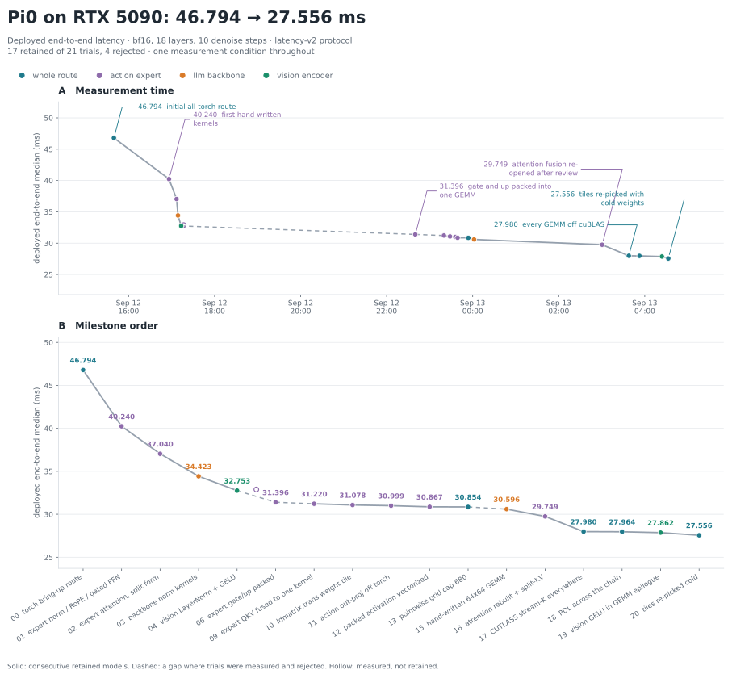

# Pi0 · RTX 5090 · run-01

First optimization run of `rtx5090/pi0`, from the all-torch bring-up route to a
hand-written CUDA route: **46.794 → 27.556 ms, 1.70×**.



## Workload and measurement conditions

| | |
|---|---|
| Target | `hardware/nvidia/rtx5090/pi0`, bf16, 18 layers, 10 denoise steps |
| Checkpoint | seeded synthetic weights, `seed=0` — Pi0 needs no asset |
| Fixture | `flash-vla/pi0-inputs-v1/seed-0` |
| Shape | 3 views × 224², 768 visual tokens, no text prompt, chunk 50 |
| Environment | RTX 5090, driver 580.142, torch 2.13.0+cu130, CUDA 13.1, `sm_120f` |
| Protocol | `latency-v2`: fresh process, first capture per leg, warmup 5, 100 reps, median |

```bash
python -m benchmarks latency --target rtx5090/pi0 --plan shipped --seed 0 \
  --warmup 5 --reps 100 --out results/pi0-rtx5090/run-01/measurements/005-shipped-final.json
python -m eval.correctness --target rtx5090/pi0 --plan shipped --steps 1 --layers 1
```

**Do not compare any of this with an H100 figure.** A different GPU is a
different comparison context; this run starts its own curve.

## Result

| # | change | median | delta |
|---|---|---:|---:|
| 0 | every call site in torch | 46.794 | |
| 1 | expert RMSNorm, RoPE scatter, gated activation in CUDA | 40.240 | **−6.588** |
| 2 | expert attention: cuBLAS GEMMs + hand-written masked softmax | 37.040 | **−3.137** |
| 3 | the same norm kernels on the backbone | 34.423 | **−2.607** |
| 4 | vision LayerNorm + GELU kernels, residual folded into GEMM beta | 32.753 | **−1.571** |
| 5 | single-pass masked softmax | 32.886 | *neutral* |
| 6 | expert gate and up packed into one GEMM | 31.396 | **−1.490** |
| 9 | expert norm + QKV + RoPE fused into one kernel | 31.220 | **−0.176** |
| 10 | that kernel's weight tile transposed by `ldmatrix.trans` | 31.078 | **−0.142** |
| 11 | action-token output projection off torch | 30.999 | **−0.079** |
| 12 | packed gated activation vectorized to 128-bit | 30.867 | **−0.132** |
| 13 | streaming pointwise grid cap 340 → 680 CTAs | 30.854 | *min −0.10, p99 −0.15* |
| 15 | hand-written 64×64 GEMM on two backbone shapes | 30.596 | **−0.249** |
| 16 | fused attention, rebuilt and split 8 ways over the keys | 29.749 | **−0.847** |
| 17 | every GEMM off cuBLAS onto CUTLASS stream-K | 27.980 | **−1.769** |
| 18 | programmatic dependent launch across the chain | 27.964 | **−0.114** paired |
| 19 | vision feed-forward GELU into the GEMM epilogue | 27.862 | **−0.102** |
| 20 | tiles re-picked with cold weights | 27.556 | **−0.306** |

Every delta in rows 1–4 is a **paired A/B in one job**: the retained route and
the candidate measured back to back, same process family, same driver, with the
retained route as leg 0. `min` and `p99` moved with the median in all four.

Row 5 is not plan-selectable — it changes a kernel the deployed route already
uses — so it is measured as the same route before and after. The final number
comes from three legs in one job at **32.886 / 32.888 / 32.887 ms, a 0.002 ms
spread**, and 32.753 is the previous job's figure for the route without it. The
0.13 ms between them is cross-job variation, not a regression, and the change is
kept for a numerical reason rather than a latency one: it removes a bf16
round-trip and moves the operator's cosine from 0.999992 to 0.999999.

Launches fell from **12831 to 2850**, −78%.

## Correctness

The reference route stays all-torch, so `eval.correctness` compares the
hand-written kernels against the implementation they replaced rather than
against themselves.

| | shallow gate | full depth (10 steps × 18 layers) |
|---|---|---|
| cosine | **0.99983** | **0.99791** (budget 0.9943) |
| rel_rms | 0.0034 | **0.0647** (budget 0.34) |
| verdict | **passed** | inside the deepest tolerance |

`replay_identical` is true. The full-depth cosine drifted from 0.99976 after
iteration 1 to 0.99791 now — 37% of the deepest budget spent, all of it bf16
rounding and reduction order. Nothing in the route computes at a lower precision
than the torch form it replaced, and the fused QKV kernel is strictly *more*
accurate than the three-launch form: it never rounds the normalized activations
to bf16 because it never materializes them.

Operator-level checks are in `correctness/`:
`lab/sm120/pi0_torch_parity.py` pins the torch backend against the TileLang
wrappers it was written from, and `lab/sm120/pi0_wrapper_bisect.py` pins each
CUDA wrapper against its torch counterpart — including with the residual buffer
deliberately aliased to the output, which is how the one real bug below was
caught.

## What was tried and rejected

**A fully fused single-kernel attention.** Correct, and **8× slower than the
split form** — 201 µs against 25 at Pi0's shape, on a torch chain of 70. ncu
says why: 32.09M instructions for 342 MFLOP, because a CUDA-core dot product
costs two shared-memory loads and an FFMA per two FLOP where one `mma.sync`
does 4096 FLOP in one instruction [mma.rate.sm.bf16]. Two rounds of tuning were
also negative — transposing K in shared memory to fix a measured 16-way bank
conflict, then padding the rows, moved 214 µs to 201. **The instruction count is
the wall, not the conflicts**, and only a tensor-core mainloop clears it. Kept
unrouted in `kernels/expert_attention.cu` so the negative can be re-run.

**Folding the backbone's gated feed-forward into its second GEMM's epilogue.**
The two GEMMs write the same tile coordinates, so the gate projection's
epilogue can read the up projection's output as its C operand and compute
`gelu(gate) * up` there, removing a launch and a 75.5 MB pass. Written
(`kernels/cutlass_epilogue.cuh`, kept) and **measured neutral**: 479.74 us
against 476.93 on one tile and 484.24 against 487.76 on another, correct at
cos 0.999997 either way. The pass it removes was already cheap because the
768 x 16384 expansion stays in L2 -- the traffic argument that motivated it
assumed DRAM -- so the epilogue only moved the cost. The same fusion IS a win
on the vision feed-forward, where the activation follows a bias rather than a
second matrix, and that one is routed.

**Storing the vision feed-forward's down-projection weight K-contiguous.**
Re-storing that one weight (N, K) so cuBLAS sees a TN GEMM is **1.21x** at
768 x 4304 x 1152 -- 49.29 us against 59.49 for the addmm and its bias add --
and deployed it measured **30.854 -> 30.638 ms, the largest single win still
on the table**. It is rejected because it is not a layout win at all. Against
an fp32 reference the TN kernel's relative error is **2.35e-03 where the NN
kernel's is 1.66e-03**, and with
`torch.backends.cuda.matmul.allow_bf16_reduced_precision_reduction` turned off
the two errors agree to the digit and TN becomes the *slower* of the pair,
53.35 us against 51.88. The speed is bf16 split-K accumulation, and the model
gate saw it: the shallow cosine fell 0.99983 -> 0.99977 against its 0.99978
floor, the only failing gate of this run. Measurement kept at
`measurements/014-rejected-vision-ffn-down-tn.json`.

The same swap was measured across all eleven deployed GEMM shapes: 1.00x on
nine, 0.79x on the vision feed-forward's up projection, and this one.

**Filling the half-empty wave with a batched K split.** At M=768 cuBLAS leaves
most of the part idle -- `lab/sm120/pi0_gemm_wave_probe.py` shows
768 x 2048 x 2048 and 768 x 1024 x 2048 taking **the same 49.4 us for 33%
different work**, which is one wave of 128x128 tiles at 56% occupancy. Splitting
K into S independent GEMMs multiplies the tile count without changing the
arithmetic, and `torch.bmm` asks for exactly that in one kernel. It is slower in
every case, before the partial sum is even added: 2 splits of the backbone
out-projection take 53.46 us of GEMM against 49.36 for the whole thing, and the
vision up-projection goes 45.36 -> 89.16.
`lab/sm120/pi0_gemm_splitk_probe.py`.

**Three of the four small action-token projections.** All four were measured as
a paired A/B, one site per leg, against the same job's shipped leg.
`action_expert_action_out_proj` is a win and is routed: 11 launches to 3, and
−0.065 ms with both candidate legs under both control legs in an A/B/A/B.
`action_expert_state_proj` (3 launches to 1) and `action_expert_action_in_proj`
(6 to 2) came back at +0.015 and +0.007 ms, inside a ~0.05 ms cross-job spread
-- the launches they save do not show, so they stay on torch rather than add
code for nothing. `action_expert_action_mlp` as a single `torch.addmm` was
**0.202 ms slower** than torch's mm-add-copy at its 50 x 1024 x 1024 shape,
which is far more than the two launches it removes.

**A cuBLASLt GELU epilogue on the vision feed-forward.** `aten::_addmm_activation`
would fold the activation into the GEMM and save a 13.2 MB round trip, and it
measured **57.46 us against 51.31** for the separate pass at 768 x 1152 x 4304
-- the epilogue costs more GEMM than the pass it replaces (132.5 against 148.4
TFLOP/s). Its GELU is also neither spelling exactly: it sits 2.7e-03 from
tanh and 2.6e-03 from erf at bf16 output.

**`F.scaled_dot_product_attention` with a precomputed mask**: 90.3 µs against
the torch chain's 73.0 at this shape. Slower than what it would replace.

**Reducing `NUM_STAGES` to fit H100's TileLang tiles into 99 KB** (before the
route was rewritten): ran end to end and returned cos 0.898 with
`replay_identical` false. Three of those configs feed warp-specialised builders
where the stages *are* the producer buffer; at one stage the producer has
nothing to fill while the consumer reads. A race, not a tolerance.

## PDL, and why the trigger had to be swept

Every kernel in the route now carries `griddepcontrol`, so a dependent grid
starts when its producer says so rather than when the producer's last CTA
exits. The two halves are set differently because they are not symmetric.

**The wait is derived.** It sits immediately before the first read of producer
data. In most of these kernels every read is the producer's output, so it is
the first statement; `expert_qkv` is the exception worth having, because its
5.24 MB weight has nothing to do with the kernel before it and is issued
ABOVE the wait while the 104 KB activation is issued below.

**The trigger is swept**, and the sweep changed the answer. Three legs a side,
against PDL off at 28.147 ms:

| trigger | deployed | vs off |
|---|---:|---:|
| `last` | 27.913 | **−0.162** |
| `early` | 27.992 | −0.083 |
| `mid` | 28.037 | −0.038 |

`last` wins, which is the opposite of the obvious guess. A trigger on the last
line is close to a no-op -- the kickoff already fires when every CTA has exited
-- so what this route gets from PDL is the WAIT: the consumer's CTAs are
scheduled and its producer-independent work runs while the producer finishes.
Releasing the dependent grid any earlier only hands it SMs the producer still
wants.

**It needs both sides, and that is why it went in after the GEMMs moved.** With
cuBLAS still in the route, PDL was a *regression* at every trigger position --
28.166/28.177/28.287 against 28.054 off -- because a cuBLAS kernel carries
neither instruction, so no chain forms and the wait is pure cost. The CUTLASS
GEMMs are launched through this repo's own entry point, which wraps
`Operator::invoke` with the pair.

**One bug worth recording.** The first version of that wrapper used
`cutlass::arch::wait_on_dependent_grids()`. That is behind `CUTLASS_GDC_ENABLED`,
which needs `CUTLASS_ENABLE_GDC_FOR_SM100` defined, and without it BOTH the wait
and the trigger compile to nothing -- so the GEMM was launched early by the
attribute and never waited. `replay_identical` went false and the model cosine
fell to 0.99973. A wait that is compiled out is a race, not a slow kernel, which
is the same failure mode the wiki warns about for a wait placed too late.

## One negative that was wrong, and how it was caught

**A tensor-core single-kernel attention was recorded here as rejected at
79.5 us, 3.1x slower than the split form.** That was wrong twice over, and the
review that caught it named both.

*The baseline had not been brought forward.* The 79.5 us kernel predated the
fused QKV projection and used none of what that work established: it built
fragments from twelve scalar shared loads instead of `ldmatrix`, ran four warps
so a scheduler had exactly one, and stored V transposed by scatter -- which is
the same 8-way bank conflict `ldmatrix.trans` was introduced to remove. Re-doing
it with all three took the same kernel to **32.3 us, 2.46x**, with no change to
its numerics. A negative measured on a baseline that predates its own fixes is
not a negative.

*The round-trip cost was estimated against the wrong memory.* Split-KV was
dismissed on a combine cost of 6.8 us, computed by putting a 5.2 MB partial
buffer through [ld.bw.dev.dram]'s 1524 GB/s. That buffer fits L2, and this
machine's own `copy_` measures **4879 GB/s** in `pi0_bandwidth_bench.py` -- the
estimate was 3x too expensive, against a main loop it was being compared to.

With both corrected the site is a win, not a loss. See the table in
`action_expert_attention`'s wrapper for the split sweep; the shipped form is
8 splits at **18.94 us against the split form's 25.2**, and **−0.847 ms
deployed**, the largest single step of this run.

What stands from the original analysis is narrower and still true: 408 flat
queries is 26 mma M tiles, so the QUERY axis alone cannot fill a 170-SM part,
and `pattern-tail-effect` is right that no scheduler invents tiles. The error
was concluding from that that the call site had no room, when the key axis was
sitting there unused.

## One bug worth recording

The first form of the vision residual projections computed `out = x @ w + bias`
and then added `res`. The graph binds `res` to the buffer being written on those
call sites, so the add read a residual the GEMM had already overwritten: model
correctness came back at **cos 0.057**. The torch form it replaced evaluates the
whole expression before copying and is alias-safe by construction. The fix puts
the residual in as the GEMM's beta term.

The operator bisect passed the whole time with distinct buffers. It only
reproduced the failure once `res` was deliberately aliased to `out`, at cos
0.962. **A parity test that does not exercise the aliasing the graph actually
uses proves nothing about it.**

## Where the time goes now

Floor model after iteration 20 (`artifacts/profile/floor9.json`), and a second
column the floor model does not carry.

| segment | measured | ceiling | % |
|---|---:|---:|---:|
| `llm_backbone` | 13.93 | 11.74 | 119% |
| `action_expert` | 10.08 | 7.64 | 132% |
| `vision_encoder` | 4.05 | 2.73 | 148% |
| **attributed total** | **28.06** | **22.07** | **127%** |

Wall clock is 27.56 ms; the attributed total exceeds it because PDL makes
kernels overlap deliberately, so their durations overlap too.

**The 22.07 ms ceiling is not reachable and should not be quoted as a target.**
It divides every compute-bound site by [mma.tflops.dev.bf16]'s 253 TFLOP/s,
which is 100% of the measured tensor peak. The best GEMM in this route reaches
**228 TFLOP/s, 90%** -- backbone gate/up, 8 distinct 67 MB weights cycled so
none is cached. Re-deriving the ceiling with compute sites at 90% instead of
100%:

| | |
|---|---:|
| attributed total | 28.06 ms |
| floor model ceiling, compute at 100% of peak | 22.07 ms |
| ceiling at the 90% this stack reaches | **23.76 ms** |
| genuinely addressable | **4.40 ms** |

And that 4.40 ms is concentrated, not spread:

| call site | measured | floor at 90% | left |
|---|---:|---:|---:|
| `action_expert_attention` | 2.134 | 0.835 | 1.299 |
| `action_expert_norm_qkv_rope` | 1.972 | 1.268 | 0.703 |
| `llm_backbone_norm_gated_ffn` | 8.028 | 7.696 | 0.332 |
| `action_expert_norm_gated_ffn` | 2.966 | 2.646 | 0.320 |
| `llm_backbone_attention` | 0.669 | 0.361 | 0.308 |
| `vision_encoder_norm_ffn_up` | 1.202 | 0.903 | 0.299 |
| everything else | — | — | ≤0.22 each |

Two caveats on the top row. `action_expert_attention`'s floor assumes a single
kernel touching 1.26 MB, and the shipped form splits the key axis eight ways and
writes 3.3 MB of fp32 partials; costing that honestly puts its floor near 1.55 ms
and its real headroom near 0.58, not 1.30. And the two vision residual sites look
like they still carry a separate bias pass, but the site measures 16.77 us against
a 16.14 us standalone GEMM -- **PDL has already hidden it**, which is why folding
the bias into the epilogue was not pursued.

## Next, in order of expected value

1. **`action_expert_norm_qkv_rope`**, 0.70 ms and the largest honest item. It
   is memory bound and reaches 920 GB/s cold against [ld.bw.dev.dram]'s 1524.
   The reason is visible in the arithmetic: each of its 80 CTAs reads all of x,
   so the site moves 8.3 MB of activation against 5.24 MB of weight where its
   ceiling assumes 5.97 MB total. Fewer CTAs would fix the redundancy and cost
   warps; the tiling was re-swept cold and does not move, so this needs a
   different decomposition rather than a different constant.
2. **`action_expert_attention`**, about 0.58 ms once the split-KV partials are
   costed into its floor.
3. **fp8.** Measured, not adopted: 2.34x on the backbone's gated feed-forward
   (244.04 -> 104.88 us, 493 TFLOP/s against a 506 ceiling) and 2.15x on its
   down projection. It costs a relative error of 3.7e-02 against an fp32
   reference where bf16 is 1.7e-03, and row-wise scaling does not improve it --
   on a random-weight fixture the error is e4m3's mantissa, not the
   granularity. `eval/tolerances.py` knows only a bf16 policy and `parity.md`
   is explicit that a kernel task does not invent one, so this is a decision
   about the deployment's numerical contract rather than a patch.
   `lab/sm120/pi0_fp8_probe.py`.
4. **PDL.** Now shipped; see the section above.  Formerly: available on this part -- ptxas accepts `griddepcontrol` for
   sm_120, sm_120f and sm_120a -- and worth 1.166x under graph replay on a
   chain shaped like Pi0's (`lab/sm120/pdl_unit.cu`). It needs the producer to
   trigger early AND the consumer to wait late, so both must be hand-written,
   and cuBLAS currently sits between nearly every pair. It grows as more GEMMs
   become hand-written.
4. **`llm_backbone_attention`**, 0.350 ms and still torch. The expert's kernel
   now exists and wins, but at BLOCK_M 16 each query tile re-reads all of K and
   V: 384 tiles x 786 KB is 302 MB of L2 traffic at the backbone's shape, so it
   needs a larger BLOCK_M first. BLOCK_M 32 was tried on the expert's shape and
   lost -- 208 registers against 128, halving occupancy -- so this is a real
   retune, not a constant change.
5. **`action_expert_norm_qkv_rope`'s last 0.578 ms.** Every CTA reads all of x,
   8.3 MB of L2 traffic against 5.24 MB of weight.
