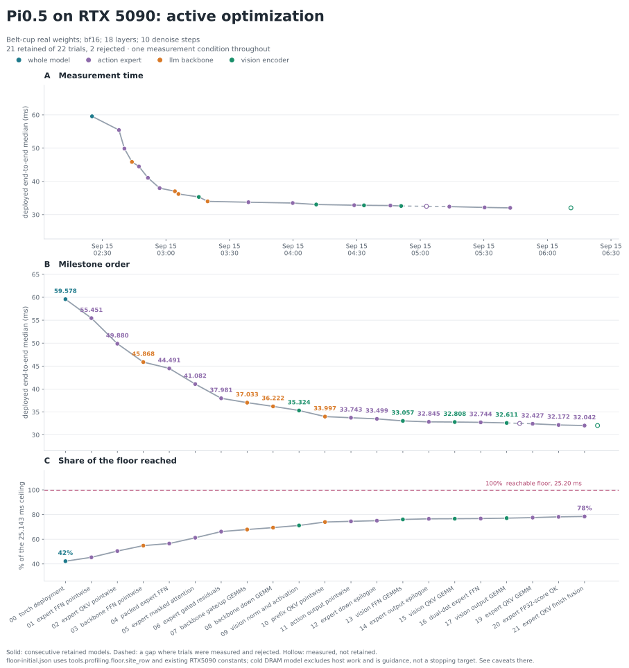

# Pi0.5 on RTX 5090 — gpt6 run 01

Active optimization run on branch `gpt6-pi05-5090`, starting at `5ac75bc`.

Workload: converted kai0/pi05-belt-cup/orbax-39999+openpi-convert-pi05_aloha weights; bf16; batch 1; 3 x 224 x 224 images; 200 prompt slots; chunk 50; 18 layers; 10 denoising steps. Timing input seed 42. The existing official oracle uses its saved seed-0 fixture, so correctness and timing fixtures are identified separately.

Environment: RTX 5090 (170 SMs, 96 MiB L2), driver 580.142, torch 2.13.0+cu130, Triton 3.7.1; CUDA 13.1 for native builds. Clocks unlocked, unchanged. Machine paths are configured by the ignored `artifacts/rtx5090-pi05/gpt6-env.sh`. The previously absent tokenizer was obtained from OpenPI's documented PaliGemma asset before the first valid measurement; oracle token IDs agree.

Measurements use the workflow's existing 5 warmup / 100 repetitions in a fresh process per version, initial capture only. End-to-end wall time includes input staging, host processing, graph replay and final synchronization, excluding load/capture. Timing runs without a profiler, serially on this GPU. Xorg is present; there were no other compute processes before the initial run.

## Commands

Source the ignored environment file. CHECKPOINT resolves to the converted belt-cup directory. Each raw measurement records resolved options.

```sh
. artifacts/rtx5090-pi05/gpt6-env.sh
.venv/bin/python -m benchmarks latency --target rtx5090/pi05 --plan shipped --seed 42 --option converted_checkpoint="$CHECKPOINT" --option checkpoint_id=kai0/pi05-belt-cup/orbax-39999+openpi-convert-pi05_aloha --option checkpoint_digest=kai0/pi05-belt-cup/orbax-39999+openpi-convert-pi05_aloha --out results/pi05-rtx5090/gpt6-run-01/measurements/NNN.json
.venv/bin/python -m eval.pi05.parity compare --oracle artifacts/rtx5090-pi05/oracle-belt-cup --checkpoint "$CHECKPOINT" --checkpoint-id kai0/pi05-belt-cup/orbax-39999+openpi-convert-pi05_aloha --target rtx5090/pi05 --plan shipped
```

## Evidence and current uncertainty

- Initial median: 59.5779 ms, min 59.4828, p99 59.6741; raw samples in `measurements/000.json`.
- Initial full-depth official comparison passed; `correctness/000-official.json` contains prefix KV and action errors. Oracle provenance is a vendored OpenPI forward and records its dirty source status. This is numerical agreement, not robot task-success validation.
- The separate pi05_base checkpoint previously failed prefix KV tolerance. This run does not claim its correctness or performance.
- Leading bottlenecks and reachable floor are pending current-workload profiling.



## Initial profiling and candidate selection

Full-forward GPU correlation groups map to vision 5.493 ms, backbone 25.458 ms, expert 28.592 ms (profiling overhead excluded from speedup claims). The expert's FFN is 8.559 ms / 3780 launches and QKV 7.768 ms / 4860 launches. Two independent candidate worktrees fuse their pointwise chains around unchanged GEMMs. The backbone FFN is 15.466 ms / 272 launches, so its norm/GELU/product fusion is a third candidate. GPU jobs remain serial.

A default native-SDPA screening on random actual-shape attention tensors was slower: 76.27 us vs 32.44 us warm-cache call time. Explicit efficient-attention dispatch agrees; this installed cuDNN attention route rejects head_dim 256. This rejects these tested dispatches, not fused attention in general. Raw records: measurements/sdpa-screen.json and sdpa-dispatch.json.

The existing cost model predicts a 25.143 ms datasheet floor and 25.202 ms measured-primitive estimate. It prices every call's traffic as cold DRAM and omits host work; cache-sensitive rows and changing unlocked clocks prevent treating this sum as proof of exhaustion. Individual expert FFN estimate is 2.647 ms and QKV 1.268 ms.

## 001 — Expert FFN pointwise fusion, retained

Hypothesis: remove 17 pointwise/cast launches per FFN call while retaining both torch.mm and all bf16 rounding points. Actual belt-cup invocation snapshots at seed42 gave exact outputs/factors for calls 0/17/90/179; local 180-call graph median 54.9115 -> 25.8879 us/call (5.224 ms sum-equivalent estimate, not a deployment measurement). Full-depth official parity passed after integration.

Deployed shipped median 59.5779 -> 55.4515 ms (-4.1264 ms, -6.93%). Raw reports 000/001 use matched conditions and independent processes. Observed clocks were 2872/2865 MHz and memory 13801 MHz, both ending at 52 C; candidate reports a software-power clock reason, so its smaller gain than the local estimate is not assigned solely to one cause. Large median separation versus within-run spread supports retaining it; no periodic control rerun was added. Source revision 23f3c8b.

## 002 — Expert QKV pointwise fusion, retained

Two native kernels around the unchanged BF16 GEMM remove repeated casts and elementwise launches. Synthetic actual-shape tests at magnitudes 1, 1e-3 and 1e3 are bitwise equal including the factor, preserving KV-cache prefix sentinels; cold rotating graph samples are saved in the QKV candidate record. Full-depth real-weight official comparison passed after integration and its action metrics equal 001.

Deployed median 55.4515 -> 49.8801 ms, source c8f5e15. It is compared to the already-retained FFN version, not the initial model. The complete loaded plan is in measurements/002.json.

## 003 — Backbone FFN pointwise fusion, retained

Hypothesis: remove full FP32 cast/intermediate traversals around the two unchanged large GEMMs. Seventeen real call snapshots passed existing shallow tolerance: worst output rel_rms 1.14e-4 and minimum cosine 0.9999999935. Local graph totals torch 15.698/15.975 ms vs fused 11.936/11.971 ms, with reference drift noted. Full-depth official comparison passed after deployment.

Deployed median 49.8801 -> 45.8682 ms, source 571b9b4. Raw local/official/end-to-end evidence is saved alongside this trial. The change affects prefix KV numerics within existing tolerances, not the model precision policy.

## 004 — Packed expert FFN, retained

Hypothesis: pay skinny-GEMM launch/scheduling overhead once for gate and up. One BF16 GEMM writes two contiguous halves; native activation preserves BF16 projection rounding. Source tensors and packed weights are retained in the wrapper; all GPU storage uses runner scratch. Additional packed weights: 288 MiB for 18 layers.

Selected real invocation outputs/factors were bitwise equal; local median 25.8104 -> 17.1574 us/call, 1.5575 ms estimated across180 calls. Full-depth official comparison passed. Deployed shipped median 45.8682 -> 44.4914 ms, source ebfde75.

## 005 — Expert masked attention, retained

Hypothesis: use tensor-core BF16 inputs with FP32 score output to remove Q/K casts and FP32 SIMT GEMM, then fuse scale/mask/softmax into one native kernel, preserving BF16 probabilities before the unchanged P@V GEMM. Synthetic real-shape tests include out=Q alias, runtime mask changes, and masked-V independence; worst output rel_rms 1.56e-4. Local graph medians 37.8 -> 15.2 us include identical Q reset copy on both sides. Full-depth real-weight official comparison passed.

Deployed shipped median 44.4914 -> 41.0824 ms, source 4d53ad7. This native chain replaces only expert attention; the rejected native-SDPA screen remains separately recorded.

## 006 — Expert gated residuals, retained

Hypothesis: each projection keeps the existing BF16 GEMM and fuses its seven cast/mul/add/store operations into one CUDA pass. Selected real inputs at calls0/17/90/179 for both sites match bitwise. Local timings include identical residual resets on both sides: output projection19.1919 ->7.7451us, FFN down22.8162 ->12.7092us, giving3.8797ms sum-equivalent potential. Scratch adds100KiB. Full-depth official comparison passed.

Deployed median41.0824 ->37.9806ms, source e98b74c. This comparison adds the same shared residual kernel at both expert projection sites; no GEMM or numerical tolerance changed.

The affected CPU Target declaration test initially found native library loading in the backbone wrapper factory. Loading now occurs only on first execution, allowing graph/route declarations without a GPU/compiler. CUDA arithmetic is unchanged; the scoped declaration/route checks pass (8+1 checks). This loader-only fix does not add a timing point.

## 007 — CUTLASS backbone gate/up GEMMs, retained

The two large BF16 projections now use the tested128x128x64 Stream-K tile; native RMSNorm/GELU and BF16 projection output stay unchanged. The vendor revision matches the original screening library (main's cb4247394dd82148787aed73e5dc7cef33cbf862); a different installed CUTLASS checkout was detected and avoided. The two best screened tiles differed by less than the control drift, so one simpler cfg0 is used. Native compiler reports254registers and0spills; model capture/replay and all17realFFN calls passed.

Local FFN total11.591/11.862 ->10.866/10.883ms; full-depth official comparison passed. Deployed median37.9806 ->37.0332ms, source594e697. Only the gate/up call site is routed to CUTLASS in this trial; down is next.

## 008 — CUTLASS backbone down projection, retained

The same cfg0 Stream-K tile now runs the down projection with C=D and alpha=beta=1, preserving the existing residual expression. All17 actual calls passed existing tolerance; local total5.827/5.869 ->5.038/5.039ms. Full-depth official comparison passed.

Deployed median37.0332 ->36.2217ms, source54b5946. This is the incremental gain after007. Native workspace and pointer-bound plans are owned per runner and initialized during warmup.

## 009 — Vision normalization and activation, retained

FP32 centered-variance LayerNorm now uses a single CUDA pass, retaining BF16 normalized inputs to unchanged bias-fused GEMMs. FFN GELU runs in place after the projection rounds to BF16. Selected real layers passed local tolerance; 27-layer ABBA estimates about 1.07 ms of headroom. Full-depth official comparison passed (action cosine 0.9999852922, rel_rms 0.00542377). CPU Target binding also passes without a CUDA compiler environment.

Deployed median 36.2217 -> 35.3236 ms, source cc5f0a8. Both measurements ended at 2865 MHz SM, 13801 MHz memory and 57 C with the same power clock reason; observed within-run variation is much smaller than the 0.8981 ms gain.

## 010 — Prefix QKV pointwise fusion, retained

Reuse the Target-local RMSNorm kernel, retain the BF16 QKV GEMM, and replace the cast/rotation/scatter chain with one native pass. Selected actual layers 0/9/17 matched bitwise locally; 18-call graph median decreased from 137.960 to 58.0524 us per call (1.4383 ms sum-equivalent estimate). Full-depth official comparison passed (action cosine 0.9999866853, rel_rms 0.00516067). CPU declarations pass without a compiler environment.

Deployed median 35.3236 -> 33.9966 ms, source 7085a4b. Ending SM/memory clocks match 009; temperatures were 57/55 C. The 1.3271 ms gain exceeds within-run spread. Total reduction from the initial 59.5779 ms deployment is 42.94%; BF16 precision, full 18 layers and 10 denoise steps remain the measured workload. The model has remaining GEMM headroom; the initial floor is guidance only.

## Next bottleneck after 010

The new whole-forward trace maps GPU kernel duration to vision 4.539 ms, backbone 18.386 ms and expert 10.717 ms. Focused backbone attribution has no sequence mismatch or unattributed launch. Its FFN is 10.508 ms, including 10.026 ms in 34 gate/up GEMMs and 0.482 ms in native RMSNorm/GELU. Down GEMMs add 4.835 ms. Profiler time is diagnostic, not an extra latency measurement.

A controlled 12-tile expert screen on 18 actual weight sets found a small candidate: cfg9 packed GEMM 13.392 us vs torch 13.774/13.787 us, down 9.561 us vs 10.140/10.137 us. All configurations passed local tolerance. The approximately 0.17 ms model sum-equivalent is unverified; cfg9 remains a candidate while the larger backbone hotspot is investigated. The probe initially hit a native-library initialization collision; standalone and dual-library probes isolated GNU-unique CUTLASS TLS sharing, then reusing the existing main cfg0 library resolved the diagnostic failure. See lab/pi05/cutlass_expert_screen.md and measurements/expert-cutlass-screen.json.

The focused NCU capture ran the deployed gate on saved actual layer-0 operands, with cache-control all, clock-control none, kernel replay and one NVTX-selected launch (5 passes). Tensor activity was 92.06% of sustained elapsed peak, versus DRAM 14.63% and L2 49.03%. The kernel uses 254 registers/thread, 96 KiB dynamic shared memory and one 128-thread CTA resident per SM. This supports tensor work as the dominant limit of this gate implementation; low occupancy alone is not an optimization target. Its 313.216 us profiler duration uses isolated cold replay and must not be compared as a deployment version. Only NCU used sudo; report export/read required no ownership change.

Focused expert attribution after 010 is 10.679 ms in 3080 launches. Packed FFN is 2.840 ms, attention 2.197 ms, QKV 2.131 ms, FFN down residual 1.870 ms, output-projection residual 1.375 ms and action output head 0.217 ms. Each residual still has cuBLAS GEMM, split-K reduction and native gate/add kernels; the native add itself costs about 1.03 us per call in this trace. Candidate estimates must use this current evidence rather than summing unrelated isolated timings.
