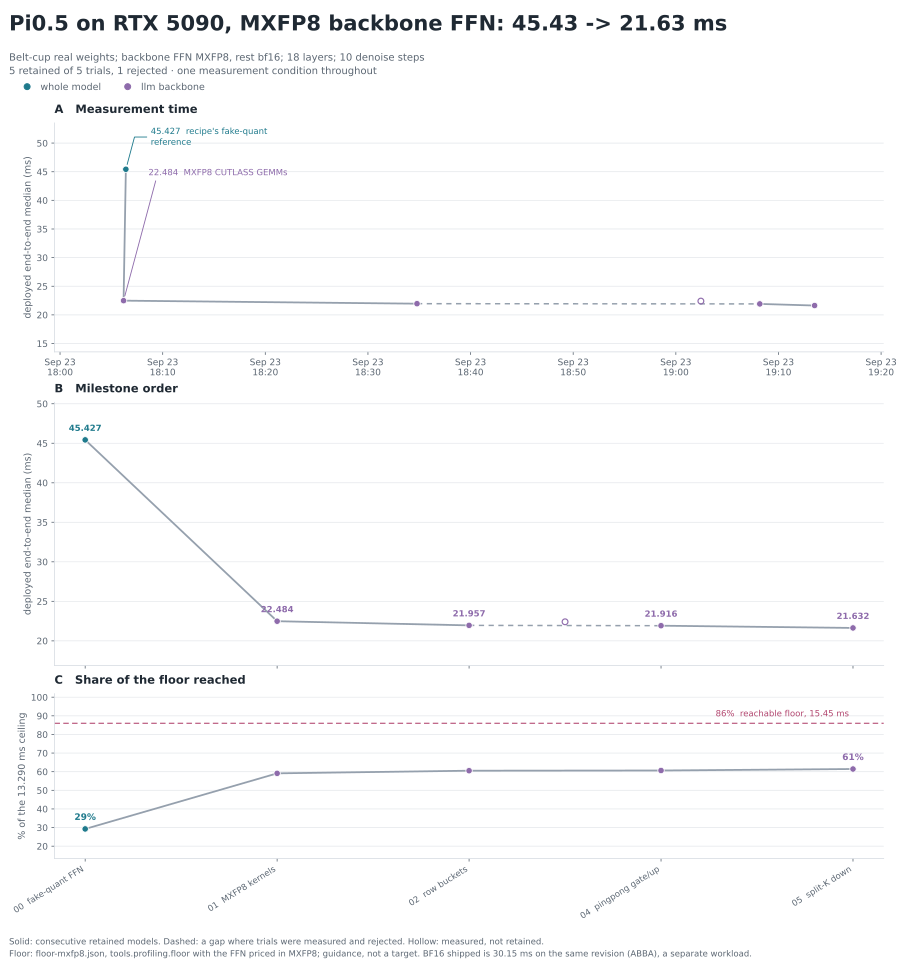

# Pi0.5 on RTX 5090 — MXFP8 backbone FFN (`mxfp8-llm-ffn`)

Optimization run of the quantized workload `mxfp8-llm-ffn` on branch
`exp/pi05-5090/mxfp8-llm-ffn`, starting at `29a29ea`. The recipe puts the three
GEMMs of every LLM-backbone FFN layer (gate, up, down) in MXFP8: E4M3 values
with one UE8M0 scale per 32 elements along K, weights quantized once from BF16,
activations quantized on the device. Every other call site keeps its BF16 route.
The forward runs 17 of the 18 FFN layers: the last one does not reach the prefix
KV cache, so the graph omits it in every plan.
The recipe was approved on its quality on 408 LIBERO observations
([`quant-pi05-ffn-libero`](../../quant-pi05-ffn-libero/compare.md)); its math is
fixed in `rtx5090/pi05/target.py` (`QUANTIZATION`) and recorded in every
identity's `execution_variant.quantization`.

A quantized workload is its own comparison context. This curve starts at the
recipe's fake-quant reference, and BF16 → MXFP8 is a latency/quality trade-off,
not an optimization gain. For scale, the BF16 shipped plan on the same revision
measures **30.07 ms** ([`measurements/bf16-shipped.json`](measurements/bf16-shipped.json)).

**Result.** Deployed version 005 (`4e2cd93`; records at `cb3706e`, same kernels):
**21.63 ms**. Against BF16 shipped on the same revision, measured ABBA in
separate processes: 30.15 → 21.76 ms, **−8.39 ms (−27.8%)**
([`final-bf16-vs-mxfp8-*.json`](measurements/)). Kernel against recipe
reference within the unchanged BF16 tolerances; official parity passes at both
row buckets with about twice BF16's action error. LIBERO closed loop not run.



## Workload and environment

Converted kai0/pi05-belt-cup/orbax-39999+openpi-convert-pi05_aloha weights;
batch 1; 3 × 224 × 224 images; 200 prompt slots; chunk 50; 18 layers; 10
denoising steps; timing input seed 42. RTX 5090 (170 SMs, 96 MiB L2), driver
580.142, torch 2.13.0+cu130, CUDA 13.1 for native builds, CUTLASS `cb424739`
(the repository's submodule). Clocks unlocked; the 600 W limit is enforced and
the MXFP8 version runs at it (SW power cap reason active, 593 W).

Measurements follow the workflow's conditions: fresh process per version, 5
warmup and 100 measured iterations, median, no profiler, serial on this GPU
under `/tmp/flash-vla-rtx5090.lock`. The checkpoint is passed through the
ignored symlink `artifacts/models/pi05_belt_cup_pytorch`, so no measurement
records a machine path.

```sh
. artifacts/rtx5090-pi05/gpt6-env.sh
ID=kai0/pi05-belt-cup/orbax-39999+openpi-convert-pi05_aloha
python -m benchmarks latency --target rtx5090/pi05 --plan shipped --seed 42 \
  --option quantization=mxfp8-llm-ffn --option converted_checkpoint=artifacts/models/pi05_belt_cup_pytorch \
  --option checkpoint_id=$ID --option checkpoint_digest=$ID --out results/pi05-rtx5090/mxfp8-llm-ffn/measurements/NNN.json
python -m eval.pi05.parity compare --oracle artifacts/rtx5090-pi05/oracle-belt-cup \
  --checkpoint artifacts/models/pi05_belt_cup_pytorch --checkpoint-id $ID --quantization mxfp8-llm-ffn
python -m eval.correctness --target rtx5090/pi05 --steps 1 --layers 2 --isolate --option quantization=mxfp8-llm-ffn ...
python lab/pi05/mxfp8_gemm_screen.py --out results/pi05-rtx5090/mxfp8-llm-ffn/gemm-screen.json
```

## Correctness

The recipe's kernels are held to its fake-quant reference
(`backends/fake_quant_ffn.py`: the operands are quantized by the same quant_ops
kernels and multiplied exactly, with the BF16 route's rounding points), with the
BF16 tolerances unchanged (`eval/tolerances.py`, tier `mxfp8`).

| check | result |
|---|---|
| Backend at real shapes, 2 layers, graph replay (`tests/test_pi05_mxfp8_backbone.py`) | FFN contribution rel RMS 1.7e-4, over 99% of outputs bit-identical |
| In-engine, 2 layers, isolated, belt-cup weights ([`recipe-layers2-isolated.json`](correctness/recipe-layers2-isolated.json)) | prefix K/V rel RMS 1.8e-4 / 2.7e-4 against the reference plan; within tolerance |
| In-engine, full depth, isolated ([`recipe-full-isolated.json`](correctness/recipe-full-isolated.json)) | drift report: deepest prefix V cosine 0.99853; actions rel RMS 0.0021 |
| Same, BF16 workload for scale ([`bf16-full-isolated.json`](correctness/bf16-full-isolated.json)) | deepest prefix V cosine 0.99972; actions rel RMS 0.0020 |
| Official OpenPI (BF16 oracle), MXFP8 ([`official-mxfp8-llm-ffn.json`](correctness/official-mxfp8-llm-ffn.json)) | passed; actions rel RMS 0.0090, deepest cosine 0.99830 |
| Official OpenPI, BF16 shipped ([`official-bf16.json`](correctness/official-bf16.json)) | passed; actions rel RMS 0.0042, deepest cosine 0.99931 |

Which row bucket a fixture exercises depends on its prompt and state tokens:
the official oracle (seed 0) has 903 valid prefix rows and runs the full
bucket, the timing fixture (seed 42) has 895 and runs the short one. The short
bucket is checked against the official model with the 896-row oracle of the
BF16 run's iteration 023 (`lab/pi05/bucket_switch.py`, see 005). At a
short-bucket fixture, `eval.correctness` compares whole buffers including the
padding rows, which the bucketed kernels leave out; BF16 shipped shows the same
disagreement there (seed 42, 2 layers: prefix V cosine 0.767 for both), so its
prefix numbers at seed 42 say nothing about the valid rows.

With identical inputs the kernels reproduce the reference to 1e-4. Over 18
layers the quantized comparison drifts about twice as far as the BF16 one,
because a BF16-level difference upstream can move an E4M3 code. The action
chunk is unaffected. Against the official model, MXFP8 doubles BF16's action
error, the same ratio as on the LIBERO observations. LIBERO closed-loop
success has not been run for this recipe.

## 000 — Fake-quant reference, start

The shipped plan with both FFN call sites on `fake-quant-mxfp8`
([`plans/000-fake-quant-ffn.json`](plans/000-fake-quant-ffn.json)): **45.43 ms**.
The per-call PyTorch quantize, dequantize and FP32-output GEMMs make it the
slow end of the workload; it is its definition, not a candidate.

## 001 — MXFP8 kernels, retained

Per layer: `quant_ops.rms_norm` writes the MXFP8 activation; one CUTLASS SM120
block-scaled GEMM (`mx_float8_t`, 128×128×128 tile, persistent cooperative
schedule, PDL) multiplies it with gate|up packed as [32768, 2048] into BF16;
`quant_ops.gated_act` writes the MXFP8 hidden; the down GEMM adds its product to
the residual in the epilogue (β = 1). The hidden stays in backend scratch, so
both call sites route together (`RouteConstraint.atomic`). Quantized weights
add 1.74 GiB of scratch (99 MiB per layer); the BF16 copies stay allocated but
are not read.

Tile screen ([`gemm-screen.json`](gemm-screen.json); 18 layers of distinct cold
weights in one graph, median per GEMM):

| GEMM (M = 968) | 128×128 persistent | 128×64 | 128×32 | 128×128 Stream-K | 128×64 Stream-K |
|---|---:|---:|---:|---:|---:|
| gate/up N = 32768, K = 2048 | **228.2 µs** (569 TFLOP/s) | 276.5 | 437.3 | 257.0 | 297.0 |
| down N = 2048, K = 16384 | **124.2 µs** (523 TFLOP/s) | 156.8 | 229.9 | 126.4 | 157.6 |

For reference, the survey measured FlashInfer's tuned CUTLASS MXFP8 GEMM at
240.95 / 121.48 µs and cuDNN at 238.9 / 118.9 µs on these shapes
([`quant-kernel-survey-rtx5090`](../../quant-kernel-survey-rtx5090/summary.md)).

Deployed median 45.43 → **22.48 ms**, revision `5961be0`. Against BF16 shipped
on the same revision (30.07 ms), the recipe saves 7.59 ms (25.2%).

## 002 — Row buckets, retained

Hypothesis: the timing prompt leaves rows 896..967 as padding, so the last of
the eight 128-row tiles of every FFN GEMM is wasted work; skipping it should
save up to 1/8 of the GEMM time, about 0.7 ms after two early-exit launches per
GEMM. Each GEMM is planned at M = 896 and M = 968 and both plans launch; the
one the prefix mask does not select exits at once, after `griddepcontrol.wait`
so the PDL chain stays ordered through it (`RowBucket` in
`mxfp8_backbone.cu`). The backend test replays one captured graph under both
masks and checks the padding rows of the residual are untouched under the
short bucket.

Deployed median 22.48 → **21.96 ms** (−0.53 ms), revision `82a3eaa`; the two
runs do not overlap (min 21.91 / p99 22.14 against min 22.41 / p99 22.75).
Official parity and the 2-layer isolated check are unchanged
([`002-official-mxfp8-llm-ffn.json`](correctness/002-official-mxfp8-llm-ffn.json),
[`002-recipe-layers2-isolated.json`](correctness/002-recipe-layers2-isolated.json)).

The screen at both row counts
([`gemm-screen-splitk.json`](gemm-screen-splitk.json)) puts the saving at 30 µs
(gate/up) and 14 µs (down) per layer, 0.74 ms over 17 layers. The shortfall of
about 0.2 ms is the unselected plan: 34 extra launches, each a node that must
wait for its predecessor before the next GEMM may start, which also removes the
PDL overlap the GEMM had with its producer.

## 003 — One launch per bucketed GEMM, reverted

Hypothesis: the ~0.2 ms 002 left on the table is the unselected plan's launch,
so carrying both problems' parameters in one kernel and letting every CTA pick
one from the mask should recover it. Correct (the backend test, official parity
and the 2-layer isolated check are unchanged), but slower: **22.41 ms** against
002's 21.96 ms (revision `83e88fe`).

The cause is in the compiled kernels: choosing the parameter object at run time
turns every parameter load into a generic load, and ptxas spills (up to 202
bytes of spill stores per kernel, against at most 60 before). Two fixed call
sites instead of a selected reference spill more (412 bytes), since the whole
GEMM body is inlined twice. A single launch would need the choice made below
the kernel's parameter block, in the tile scheduler, which CUTLASS does not
expose; the two-launch design of 002 stays.

## 004 — Pingpong gate/up GEMM, retained

Hypothesis: the cooperative kernel's two warpgroups share one tile and stall
their MMAs during its epilogue; with pingpong each warpgroup owns a tile and one
stores while the other computes. The gate/up GEMM stores a 58-63 MB BF16 tile
set per layer, so it should gain most. Screen
([`gemm-screen-pingpong.json`](gemm-screen-pingpong.json)): gate/up 212.9 →
185.4 µs at M = 896 and 239.3 → 212.2 µs at M = 968 (same run); down does not
gain and stays persistent.

The first measurement, **21.92 ms** (revision `1236629`), was within the spread
of 002. The profile showed the gate/up kernels 182 → 171 µs per call in the
model, 0.19 ms over 17 layers, so the two versions were measured ABBA in
separate processes (002 from a detached worktree at `82a3eaa`):

| leg | version | median | min | p99 |
|---|---|---:|---:|---:|
| a1 | 002 | 21.971 | 21.916 | 22.128 |
| b1 | 004 | 21.790 | 21.737 | 21.985 |
| b2 | 004 | 21.812 | 21.756 | 21.984 |
| a2 | 002 | 21.993 | 21.927 | 22.149 |

004 is 0.18 ms faster on both pairs, matching the profile; the first 004 sample
was a high draw of the ~0.1 ms process-to-process drift. Official parity and the
2-layer isolated check are unchanged ([`004-official-mxfp8-llm-ffn.json`](correctness/004-official-mxfp8-llm-ffn.json),
[`004-recipe-layers2-isolated.json`](correctness/004-recipe-layers2-isolated.json));
raw legs in `measurements/004-abba-*.json`.

## 005 — Split-K down GEMM in the short bucket, retained

Hypothesis: at M = 896 the down GEMM has 7 × 16 = 112 tiles of 128 × 128 for
170 SMs, so a third of the SMs idle through its whole K = 16384 loop; splitting
K in three gives 336 work units, about two waves of a third of the work. The
screen ([`gemm-screen-splitk.json`](gemm-screen-splitk.json)): 116.4 → 106.7 µs
at M = 896 including the per-launch clear of the split-K counters; at M = 968
(128 tiles) splitting is slower, so each bucket now has its own configuration
and only the short one splits. Split-K reduces the FP32 partials in a fixed
order; the in-engine check reports bit-identical replays.

Deployed median **21.63 ms** (revision `4e2cd93`); ABBA against 004:

| leg | version | median | min | p99 |
|---|---|---:|---:|---:|
| a1 | 004 | 21.826 | 21.756 | 22.000 |
| b1 | 005 | 21.662 | 21.578 | 21.816 |
| b2 | 005 | 21.644 | 21.590 | 21.784 |
| a2 | 004 | 21.843 | 21.762 | 21.984 |

−0.18 ms on both pairs. Correctness: the backend test covers both buckets;
official parity at 903 rows is unchanged
([`005-official-mxfp8-llm-ffn.json`](correctness/005-official-mxfp8-llm-ffn.json));
the bucket-switch check runs the 896-row oracle, the 903-row one and the
896-row one again through one captured engine and passes each
([`005-bucket-switch-mxfp8-llm-ffn.json`](correctness/005-bucket-switch-mxfp8-llm-ffn.json),
BF16 for scale in [`005-bucket-switch-bf16.json`](correctness/005-bucket-switch-bf16.json)):

| official parity | MXFP8 actions rel RMS | MXFP8 deepest cosine | BF16 actions rel RMS | BF16 deepest cosine |
|---|---:|---:|---:|---:|
| 896 rows (short bucket) | 0.0086 | 0.99774 | 0.0033 | 0.99918 |
| 903 rows (full bucket) | 0.0090 | 0.99830 | 0.0042 | 0.99931 |

## Where it stands and what is left

The whole-model floor of this workload ([`floor-mxfp8.json`](floor-mxfp8.json),
`tools.profiling.floor` with the recipe's pricing: its two FFN call sites in
MXFP8, operands with their scales, every other call site in BF16) is
**13.29 ms** at datasheet peaks and **15.45 ms** at the rates this machine
delivers; 005 is at 61% and 71% of them. These are the figure's share-of-floor
denominators. For comparison, the BF16 workload's are 25.14 / 25.20 ms
(`gpt6-run-01`). The report is marked invalid for the reasons the BF16 floor is:
the vision encoder's datasheet BF16 peak sits below its observed rate, and an
atomic call-site pair (here the MXFP8 FFN) has no joint ceiling model.

Profile of 005 ([`profile-005-overview.json`](profile-005-overview.json); GPU
kernel time 21.62 ms). The MXFP8 FFN is 5.15 ms of it; the other 16.5 ms are the
BF16 call sites this recipe does not cover. Floors use the measured block-scaled
MMA rate, 2016 FLOP/cycle/SM
([`mma_blockscale_clock.txt`](../../quant-kernel-survey-rtx5090/mma_blockscale_clock.txt)),
at the 2.8 GHz observed under this load: 960 TFLOP/s.

| FFN item, 17 layers | time | floor | share of floor rate | what would move it |
|---|---:|---:|---:|---|
| gate/up GEMM, M = 896 | 2.92 ms (171.6 µs) | 2.13 ms (125.3 µs) | 73% | a kernel beyond CUTLASS's SM120 schedules (see below) |
| down GEMM, M = 896 | 1.71 ms (100.6 µs) | 1.07 ms (62.7 µs) | 62% | same; 112 tiles for 170 SMs is the limit split-K works around |
| `gated_act` → MXFP8 | 0.37 ms | 0 when fused | — | GeGLU + MXFP8 quantization in the gate/up epilogue |
| `rms_norm` → MXFP8 | 0.06 ms | 0 when fused | — | the previous projection's epilogue |
| unselected-bucket launches | 0.09 ms | 0 | — | bucket choice inside the tile scheduler |

Why no candidate remains in this round, each with its cost:

- **Tile shapes are exhausted within CUTLASS's SM120 block-scaled collectives.**
  M-tiles must be 128 rows (the scale-factor TMA box; a 64-row pingpong tile
  fails to compile), 256-wide tiles leave fewer than two pipeline stages in
  99 KiB, and of the remaining 128×{32,64,128} cooperative/pingpong,
  persistent/Stream-K/split-K variants the screen picked the best per GEMM and
  bucket. Going past 73% / 62% of the MMA rate needs a hand-written SM120
  kernel (e.g. deeper pipelining with a smaller epilogue footprint, or 2-CTA
  cooperation to cover the down GEMM's 112 tiles) — a multi-week kernel project.
- **The GeGLU round trip (~0.43 ms with the norm) needs a custom epilogue.**
  CUTLASS's epilogue fusion is element-wise over the output tile; GeGLU pairs
  a gate and an up column and halves the width, and the MXFP8 output needs a
  32-element amax across threads. With gate/up interleaved in the packed
  weight, a custom collective epilogue could write the MXFP8 hidden and its
  swizzled scales directly — about 0.4-0.5 ms, several days.
- **Single-launch buckets failed at the kernel-parameter level (003).** Doing it
  inside the tile scheduler is worth at most the 0.09 ms of empty launches.

Outside this recipe, the largest remaining time is BF16: the backbone QKV and
output projections (same M = 968 shape class) and the action expert. Moving
them to MXFP8 is a new recipe and needs its own quality evaluation and approval.

Conclusion checks: every compared number above is from this run (ABBA where
the gain is within the ~0.1 ms process drift); ratios name the MMA-rate
denominator and clock; the GEMMs are compute-bound with weights streamed from
DRAM (64 / 32 MiB per layer at 1.8 TB/s, 36 / 18 µs, under the compute time)
and the GeGLU intermediate (58 MB) L2-resident; the negative results carry
their toolbox (CUTLASS `cb424739` SM120 collectives, CUDA 13.1); the
unavailable tile shapes were probed by compiling them.
