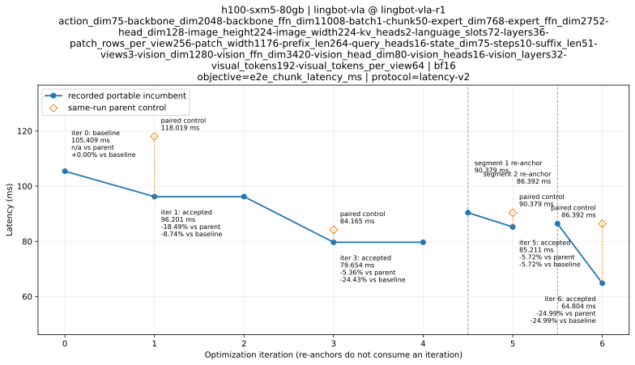

# h100-sxm5-80gb | lingbot-vla-r1

Objective: e2e_chunk_latency_ms; protocol: latency-v2.

Representative context: [sha256:bda8df25ed1b0d9792ea69c9fb3bdda3a5d277aa23237059fc2f029e3a858765](contexts/sha256:bda8df25ed1b0d9792ea69c9fb3bdda3a5d277aa23237059fc2f029e3a858765/summary.json). Anchor 86.392 ms; current portable incumbent 64.804 ms (1.333× within this segment).

[Summary](summary.json) · [Trace](trace.json)

