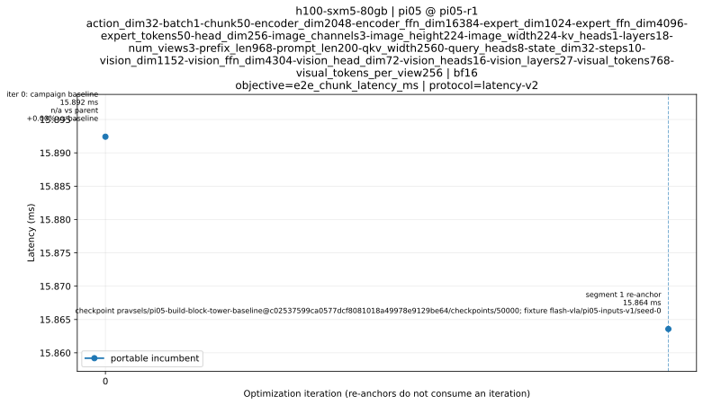

# h100-sxm5-80gb | pi05-r1

Objective: e2e_chunk_latency_ms; protocol: latency-v2.

Representative context: [sha256:d927a7195e00c8418b061564b922bd80eec9dce845436fd3c99c41250bfe36a1](contexts/sha256:d927a7195e00c8418b061564b922bd80eec9dce845436fd3c99c41250bfe36a1/summary.json). Anchor 15.892 ms; current portable incumbent 15.892 ms (1.000× within this segment).

[Summary](summary.json) · [Trace](trace.json)

